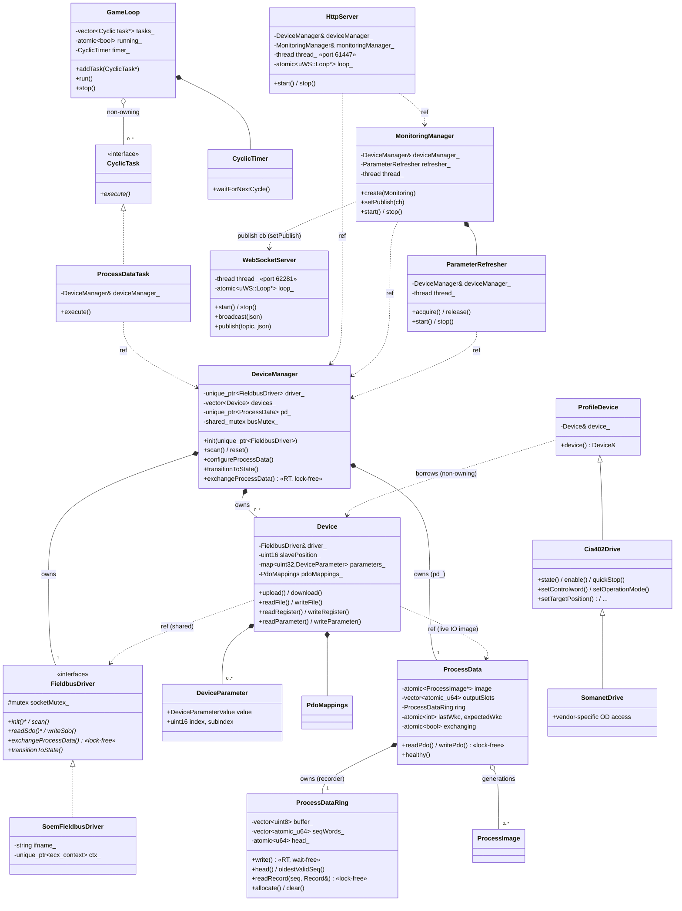

# Class Diagram

> **Hand-maintained.** This document is derived by reading the source, not auto-generated.
> GitHub renders the Mermaid diagram below natively. Ownership semantics (owns vs.
> references, cardinality) reflect *intent* read out of the headers — update this file when
> the structure changes.

The composition root is `main()` (`apps/motion_master/main.cc`), which owns every
subsystem on the stack and wires references between them. There is no `App` class.

## Diagram



## Ownership and references

`*--` = owns (by value / `unique_ptr` / `vector`). `..>` = references (raw `&`, non-owning).
`<|..` = implements an interface.

| Holder | Member | Type | Owns? | File |
|---|---|---|---|---|
| `GameLoop` | `tasks_` | `vector<CyclicTask*>` | No — caller owns | `apps/motion_master/game_loop.h` |
| `GameLoop` | `timer_` | `CyclicTimer` | Yes | `apps/motion_master/game_loop.h` |
| `ProcessDataTask` | `deviceManager_` | `DeviceManager&` | No | `apps/motion_master/process_data_task.h` |
| `HttpServer` | `deviceManager_`, `monitoringManager_` | `&` | No | `apps/motion_master/http_server.h` |
| `WebSocketServer` | — (publish target for `MonitoringManager::setPublish`) | — | No | `apps/motion_master/ws_server.h` |
| `MonitoringManager` | `refresher_` | `ParameterRefresher` | **Yes** | `libs/node/monitoring_manager.h` |
| `MonitoringManager` | `deviceManager_` | `DeviceManager&` | No | `libs/node/monitoring_manager.h` |
| `ParameterRefresher` | `deviceManager_` | `DeviceManager&` | No | `libs/node/parameter_refresher.h` |
| `DeviceManager` | `driver_` | `unique_ptr<FieldbusDriver>` | **Yes (exclusive)** | `libs/node/device_manager.h` |
| `DeviceManager` | `devices_` | `vector<Device>` | **Yes** | `libs/node/device_manager.h` |
| `DeviceManager` | `pd_` | `unique_ptr<ProcessData>` | **Yes** | `libs/node/device_manager.h` |
| `ProcessData` | `ring` | `ProcessDataRing` | **Yes** | `libs/node/process_data.h` |
| `ProcessData` | `outputSlots` | `vector<atomic<uint64_t>>` | **Yes** | `libs/node/process_data.h` |
| `ProcessData` | `generations` | `vector<shared_ptr<const ProcessImage>>` | **Yes (retained)** | `libs/node/process_data.h` |
| `Device` | `driver_` | `FieldbusDriver&` | No — same instance `DeviceManager` owns | `libs/node/device.h` |
| `Device` | `processData_` | `ProcessData*` | No — points at `DeviceManager::pd_` | `libs/node/device.h` |
| `Device` | `parameters_` | `unordered_map<uint32_t, DeviceParameter>` | **Yes** | `libs/node/device.h` |
| `Device` | `pdoMappings_` | `PdoMappings` | **Yes** | `libs/node/device.h` |

## Inheritance

The design favours composition. Two of the three hierarchies are single-interface dispatch
points; the third is a stateless view chain:

| Derived | Base | File |
|---|---|---|
| `ProcessDataTask` | `CyclicTask` | `apps/motion_master/process_data_task.h` |
| `SoemFieldbusDriver` | `FieldbusDriver` | `libs/comm/soem_fieldbus_driver.h` |
| `Cia402Drive` | `ProfileDevice` | `libs/node/cia402_drive.h` |
| `SomanetDrive` | `Cia402Drive` | `libs/node/somanet_drive.h` |

`SpoeDriver` (SPoE) is a further `FieldbusDriver` implementation noted in the design docs.

**The drive-profile chain is *not* `Device` inheritance.** `ProfileDevice` and its subclasses
do **not** derive from `Device` and are not owned by `DeviceManager`; each *borrows* a `Device&`
and carries no state beyond that reference (the drive's state lives in its statusword on the
wire). A profile view is a thin, here-and-now view over a device's object dictionary —
constructed for a single operation (a stack local in an HTTP handler, or a member scoped to a
`CyclicTask`) and dropped. Because they are never stored base-typed (no `vector<ProfileDevice>`,
no polymorphic container), `SomanetDrive → Cia402Drive → ProfileDevice` is a slicing-free is-a
chain. Validate-then-bind via `createCia402Drive` / `createSomanetDrive`. See `NEXTGEN.md` for
the rationale and the Somanet free-function design.

## Key value types

```cpp
using DeviceParameterValue = std::variant<
  int8_t, int16_t, int32_t, int64_t,
  uint8_t, uint16_t, uint32_t, uint64_t,
  float, double, std::string, std::vector<uint8_t>>;
```

`DeviceParameter` holds an `index`, `subindex`, and a `DeviceParameterValue`
(`libs/node/device_parameter.h`). Dispatch on the value with `std::visit`.

See also the [threading model](THREADS.md) for how these objects are accessed across threads.
