# Class Diagram

> **Hand-maintained.** This document is derived by reading the source, not auto-generated.
> GitHub renders the Mermaid diagram below natively. Ownership semantics (owns vs.
> references, cardinality) reflect *intent* read out of the headers — update this file when
> the structure changes.

The composition root is `main()` (`apps/motion_master/main.cc`), which owns every
subsystem on the stack and wires references between them. There is no `App` class.

The wiring runs one way. `main()` names every concrete type. A subsystem names its
collaborators by reference, or through a `std::function` that `main()` supplies, so it
names no concrete type of its own. `HttpServer::Config` is the clearest case. It holds the
listen settings as plain data — the address, the port, the certificate paths — and one
`std::function` for each operation the server must delegate. Those callbacks are how the
server reaches the game loop and the auto-tuning child without naming either one.

## Diagram

```mermaid
classDiagram
    class CyclicTask {
        <<interface — mm::core>>
        +execute(CycleContext)* noexcept
    }
    class ProcessDataCyclicTask {
        <<mm::node>>
        +execute(CycleContext) noexcept
        -DeviceManager& deviceManager_
    }
    class ExampleCyclicTask {
        <<mm::example — copy-me, Tier 3>>
        +execute(CycleContext) noexcept
        -DeviceManager& deviceManager_
        -Config config_
    }
    class GameLoop {
        +addTask(CyclicTask*)
        +run()
        +stop()
        +setPeriod(microseconds)
        +health() : GameLoopHealth
        -vector~CyclicTask*~ tasks_
        -DeviceManager& deviceManager_
        -atomic~microseconds~ period_
        -atomic~bool~ running_
        -const int cpuAffinity_
        -CyclicTimer «a run local, not a member»
    }
    class CyclicTimer {
        +waitForNextCycle()
    }
    class HttpServer {
        +start() / stop()
        +addRoutes(RegisterRoutesFn)
        -Config config_
        -DeviceManager& deviceManager_
        -MonitoringManager& monitoringManager_
        -ProcedureManager& procedureManager_
        -UserCache& userCache_
        -vector~RegisterRoutesFn~ routeModules_
        -thread thread_ «port 61447»
        -light_thread_pool pool_ «32 workers»
        -atomic~uWS::Loop*~ loop_
    }
    class HttpServerConfig {
        <<HttpServer::Config — settings + callbacks>>
        +string bindAddress, certFile, keyFile
        +uint16 port
        +string version, startedConfig, corsOrigin
        +initDeviceManager «fn»
        +getLog «fn»
        +refreshCert «fn»
        +getGameLoopHealth «fn»
        +setGameLoopPeriod «fn»
        +runAutoTuning «fn»
        +autoTuningStatus «fn»
        +autoTuningSpec «fn»
    }
    class BusHealthReporter {
        <<app layer — thread 6>>
        -jthread thread_
    }
    class AutoTuningProcess {
        <<mm::auto_tuning::Process — child process>>
        +start() / stop()
        +version() / baseUrl() / pid()
        -ProcessOptions options_
        -int64 pid_
    }
    class AutoTuningClient {
        <<mm::auto_tuning::Client>>
        +run(requestBody) : expected~Response~
        +spec() : expected~Response~
        -string baseUrl_
    }
    class HttpGlobal {
        <<mm::net — one instance, in main()>>
    }
    class UserCache {
        <<mm::core>>
        +list() / read() / write() / remove()
        -path root_
        -set~string~ retained_
    }
    class RouteContext {
        <<mm::api>>
        +DeviceManager& deviceManager
        +MonitoringManager& monitoringManager
        +string_view corsOrigin
    }
    class RoutePlugin {
        <<mm::example — copy-me>>
        +registerRoutes(SSLApp&, RouteContext&)
        +summarizeDevices(DeviceManager&)
    }
    class WebSocketServer {
        +start() / stop()
        +broadcast(json)
        +publish(topic, json)
        -thread thread_ «port 62281»
        -atomic~uWS::Loop*~ loop_
    }
    class MonitoringManager {
        +create(Monitoring)
        +setPublish(cb)
        +keepFresh() / stopKeepingFresh()
        +start() / stop()
        -DeviceManager& deviceManager_
        -ParameterRefresher refresher_
        -thread thread_
    }
    class ProcedureManager {
        +start(body) «off-RT jthread»
        +snapshot() / cancel()
        -DeviceManager& deviceManager_
        -map~key,shared_ptr~Run~~ runs_
    }
    class ParameterRefresher {
        +acquire() / release()
        +start() / stop()
        -DeviceManager& deviceManager_
        -thread thread_
    }
    class DeviceManager {
        +init(unique_ptr~FieldbusDriver~)
        +scan() / reset()
        +configureProcessData()
        +transitionToState()
        +exchangeProcessData() «RT, lock-free»
        +deviceAt(pos) : DeviceHandle
        +deviceSet() : shared_ptr~DeviceSet~
        +findDevice(pos) «RT, no lock»
        +topologyGeneration()
        -shared_ptr~DeviceSet~ currentSet_
        -atomic~DeviceSet*~ publishedSet_ «RT view»
        -vector~shared_ptr~const void~~ abandoned_
        -atomic~uint64~ topologyGeneration_
        -atomic~uint64~ processImageGeneration_
        -unique_ptr~ProcessData~ pd_
        -ParameterCache parameterCache_
        -DeviceManagerConfig config_
        -mutex busOperationMutex_
        -mutex currentSetMutex_
        -shared_mutex processDataMutex_
    }
    class DeviceSet {
        <<published generation, immutable, retained to reset()>>
        +shared_ptr~FieldbusDriver~ driver
        +vector~Device~ devices
        +uint64 topologyGeneration
        +find(pos) : Device*
    }
    class DeviceHandle {
        <<a device plus the set that keeps it alive>>
        +operator bool()
        +operator*() / operator->()
        -shared_ptr~DeviceSet~ set_
        -Device* device_
    }
    class CycleGuard {
        <<DeviceManager::CycleGuard — RT>>
        +operator bool()
        -ProcessData* processData_
    }
    class Device {
        +upload() / download()
        +readFile() / writeFile()
        +readRegister() / writeRegister()
        +readParameter() / writeParameter()
        +value~T~() / setValue~T~() «RT, lock-free»
        +findParameter() «RT, no lock»
        -FieldbusDriver& driver_
        -uint16 slavePosition_
        -unique_ptr~deque~DeviceParameter~~ cells_ «the storage»
        -unordered_map~uint32,DeviceParameter*~ parameters_
        -vector~unordered_map~ retiredMaps_
        -FlatPdoMapping flatPdoMapping_
        -const ParameterCache* parameterCache_
        -unique_ptr~mutex~ parametersMutex_
    }
    class ParameterCache {
        +load() / store() «control-plane»
        +list() / readRaw() / remove()
        +enabledForVendor()
        -ParameterCacheConfig config_
    }
    class FieldbusDriver {
        <<interface>>
        +init()* / scan()*
        +readSdo()* / writeSdo()*
        +exchangeProcessData()* «lock-free»
        +transitionToState()*
        #mutex controlPlaneMutex_
    }
    class SoemFieldbusDriver {
        -string ifname_
        -unique_ptr~ecx_context~ ctx_
    }
    class DeviceParameter {
        +uint16 index, subindex
        +uint16 dataType, bitLength
        +uint64 bits «atomic_ref cell»
        +vector~uint8~ rawValue
        +loadBits() / storeBits() «RT»
        +scalar~T~() «RT»
        +currentValue() «off-RT, may allocate»
    }
    class ObjectAddress~T~ {
        +uint16 index
        +uint8 subindex
    }
    class FlatPdoMapping
    class ProcessData {
        +readPdo() «lock-free»
        +isOutputMapped()
        +healthy()
        +pauseCycle() / resumeCycle()
        -atomic~ProcessImage*~ image
        -ProcessDataRing ring
        -ProcessBuffer outScratch, inScratch
        -atomic~int~ inCycle
        -atomic~int~ lastWkc, expectedWkc
    }
    class ProcessDataRing {
        +write() «RT, wait-free»
        +head() / oldestValidSeq()
        +readRecord(seq, Record&) «lock-free»
        +allocate() / clear()
        -vector~uint8~ buffer_
        -vector~atomic_u64~ seqWords_
        -atomic~u64~ head_
    }
    class ProcessImage {
        +vector~ProcessImageEntry~ inputs, outputs
        +uint32 inputBytes, outputBytes
    }
    class ProcessImageEntry {
        +uint16 slavePosition, index
        +uint32 bitOffset
        +const DeviceParameter* parameter
    }
    class ProfileDevice {
        +device() Device&
        -Device& device_
    }
    class Cia402Drive {
        +state() / enable() / quickStop()
        +setControlword() / setOperationMode()
        +setTargetPosition() / ...
    }
    class SomanetDrive {
        +vendor-specific OD access
    }

    CyclicTask <|.. ProcessDataCyclicTask
    CyclicTask <|.. ExampleCyclicTask
    FieldbusDriver <|.. SoemFieldbusDriver
    ProfileDevice <|-- Cia402Drive
    Cia402Drive <|-- SomanetDrive

    GameLoop o-- "0..*" CyclicTask : non-owning
    GameLoop ..> CyclicTimer : constructs one on the stack, in run()
    ProcessDataCyclicTask ..> DeviceManager : ref
    ExampleCyclicTask ..> DeviceManager : ref
    GameLoop ..> CycleGuard : enters the cycle per iteration
    DeviceManager *-- CycleGuard : nested class
    CycleGuard ..> ProcessData : raises inCycle
    HttpServer ..> DeviceManager : ref
    HttpServer ..> MonitoringManager : ref
    HttpServer ..> ProcedureManager : ref
    HttpServer *-- "1" UserCache : ref (owned by main)
    HttpServer *-- "1" HttpServerConfig : owns (by value)
    HttpServerConfig ..> GameLoop : health + period, through a callback
    HttpServerConfig ..> AutoTuningClient : run + spec, through a callback
    HttpServer o-- "0..*" RoutePlugin : addRoutes (RegisterRoutesFn)
    HttpServer ..> RouteContext : builds, passes to each plugin
    BusHealthReporter ..> DeviceManager : ref
    AutoTuningClient ..> HttpGlobal : needs it initialised
    AutoTuningProcess ..> HttpGlobal : needs it initialised
    RouteContext ..> DeviceManager : ref
    RouteContext ..> MonitoringManager : ref
    RoutePlugin ..> RouteContext : reads (registration only)
    MonitoringManager ..> DeviceManager : ref
    MonitoringManager ..> WebSocketServer : publish cb (setPublish)
    MonitoringManager *-- ParameterRefresher
    ParameterRefresher ..> DeviceManager : ref
    ProcedureManager ..> DeviceManager : ref
    DeviceManager o-- "1..*" DeviceSet : publishes one, retires the rest
    DeviceSet *-- "1" FieldbusDriver : owns (shared_ptr)
    DeviceHandle ..> DeviceSet : holds a refcount on
    DeviceSet *-- "0..*" Device : owns
    DeviceManager *-- "1" ProcessData : owns (pd_)
    DeviceManager *-- "1" ParameterCache : owns
    ProcessData *-- "1" ProcessDataRing : owns (recorder)
    ProcessData o-- "0..*" ProcessImage : generations
    ProcessImage *-- "0..*" ProcessImageEntry
    ProcessImageEntry ..> DeviceParameter : ref (cell, resolved at publish)
    Device ..> FieldbusDriver : ref (shared)
    Device ..> ProcessData : ref (live IO image)
    Device ..> ParameterCache : ref (OD-definition cache)
    Device *-- "0..*" DeviceParameter
    Device *-- FlatPdoMapping
    Device ..> ObjectAddress~T~ : addressed by
    ProfileDevice ..> Device : borrows (non-owning)
```



## Ownership and references

`*--` = owns (by value / `unique_ptr` / `vector`). `..>` = references (raw `&`, non-owning).
`<|..` = implements an interface.

| Holder | Member | Type | Owns? | File |
| --- | --- | --- | --- | --- |
| `GameLoop` | `tasks_` | `vector<CyclicTask*>` | No — caller owns | `apps/motion_master/game_loop.h` |
| `GameLoop` | — | `CyclicTimer` | No member. `run()` constructs one on its stack and drops it on return | `apps/motion_master/game_loop.cc` |
| `ProcessDataCyclicTask` | `deviceManager_` | `DeviceManager&` | No | `libs/node/process_data_cyclic_task.h` |
| `ExampleCyclicTask` | `deviceManager_` | `DeviceManager&` | No | `libs/example/example_cyclic_task.h` |
| `HttpServer` | `deviceManager_`, `monitoringManager_`, `procedureManager_`, `userCache_` | `&` | No | `apps/motion_master/http_server.h` |
| `HttpServer` | `pool_` | `BS::light_thread_pool` (32) | **Yes** — every route handler runs here | `apps/motion_master/http_server.h` |
| `HttpServer` | `routeModules_` | `vector<mm::api::RegisterRoutesFn>` | **Yes** — queued plug-ins, run once at `start()` | `apps/motion_master/http_server.h` |
| `HttpServer` | `config_` | `HttpServer::Config` | **Yes** — listen settings as data, plus one `std::function` for each delegated operation, so the server names no concrete collaborator | `apps/motion_master/http_server.h` |
| `WebSocketServer` | — (publish target for `MonitoringManager::setPublish`) | — | No | `apps/motion_master/ws_server.h` |
| `BusHealthReporter` | `thread_` | `std::jthread` | **Yes** — declared last, so the members it reads are built first | `apps/motion_master/bus_health_reporter.h` |
| `BusHealthReporter` | `deviceManager` | `DeviceManager&` | No — borrowed, and it must outlive the reporter | `apps/motion_master/bus_health_reporter.h` |
| `main()` | `httpGlobal` | `mm::net::HttpGlobal` | **Yes — exactly one, before any thread starts** | `apps/motion_master/main.cc` |
| `main()` | `autoTuning` | `mm::auto_tuning::Process` | **Yes** — the child process, started before the main thread turns real-time | `apps/motion_master/main.cc` |
| `main()` | `autoTuningClient` | `optional<mm::auto_tuning::Client>` | **Yes** — empty when the child never started | `apps/motion_master/main.cc` |
| `main()` | `userCache` | `mm::core::UserCache` | **Yes** — `HttpServer` borrows it | `apps/motion_master/main.cc` |
| `MonitoringManager` | `refresher_` | `ParameterRefresher` | **Yes** | `libs/node/monitoring_manager.h` |
| `MonitoringManager` | `deviceManager_` | `DeviceManager&` | No | `libs/node/monitoring_manager.h` |
| `ParameterRefresher` | `deviceManager_` | `DeviceManager&` | No | `libs/node/parameter_refresher.h` |
| `ProcedureManager` | `runs_` | `map<key, shared_ptr<Run>>` (each owns a `std::jthread`) | **Yes** | `libs/node/procedure_manager.h` |
| `DeviceManager` | `currentSet_` | `shared_ptr<DeviceSet>` | **Yes** — the live generation, and its only owner. `init` and `scan` publish a new one | `libs/node/device_manager.h` |
| `DeviceSet` | `driver` | `shared_ptr<FieldbusDriver>` | **Yes** — the set owns the driver, so a retired set keeps a live driver object | `libs/node/device_manager.h` |
| `DeviceSet` | `devices` | `vector<Device>` | **Yes** — a published set owns its devices. `DeviceManager` reaches them through the set | `libs/node/device_manager.h` |
| `DeviceManager` | `pd_` | `unique_ptr<ProcessData>` | **Yes** | `libs/node/device_manager.h` |
| `DeviceManager` | `parameterCache_` | `ParameterCache` | **Yes** | `libs/node/device_manager.h` |
| `ProcessData` | `ring` | `ProcessDataRing` | **Yes** | `libs/node/process_data.h` |
| `ProcessData` | `outScratch`, `inScratch` | `ProcessBuffer` | **Yes** — RT-thread-only scratch | `libs/node/process_data.h` |
| `ProcessData` | `generations` | `vector<shared_ptr<const ProcessImage>>` | **Yes (retained)** | `libs/node/process_data.h` |
| `ProcessImageEntry` | `parameter` | `const DeviceParameter*` | No — points into the owning `Device`'s map, resolved at publish | `libs/node/process_image.h` |
| `Device` | `driver_` | `FieldbusDriver&` | No — the same instance the owning `DeviceSet` holds. So a retired set still has a live driver object | `libs/node/device.h` |
| `Device` | `processData_` | `ProcessData*` | No — points at `DeviceManager::pd_` | `libs/node/device.h` |
| `Device` | `cells_` | `unique_ptr<deque<DeviceParameter>>` | **Yes** — the cell arena. *The* storage of every value. A cell is never erased, so a held `DeviceParameter*` survives a re-enumeration | `libs/node/device.h` |
| `Device` | `parameters_` | `unordered_map<uint32_t, DeviceParameter*>` | No — it points into `cells_`. Each enumeration replaces the map, never the cells | `libs/node/device.h` |
| `Device` | `retiredMaps_` | `vector<unordered_map<uint32_t, DeviceParameter*>>` | **Yes** — but only for a map replaced while the real-time cycle refused to drain. A cyclic task may still walk such a map, so freeing it then is a use-after-free. Each entry is logged as an emergency | `libs/node/device.h` |
| `Device` | `flatPdoMapping_` | `FlatPdoMapping` | **Yes** | `libs/node/device.h` |
| `Device` | `parameterCache_` | `const ParameterCache*` | No — points at `DeviceManager::parameterCache_` | `libs/node/device.h` |
| `Device` | `parametersMutex_` | `unique_ptr<std::mutex>` | **Yes** — indirect only so `Device` stays movable for `vector<Device>` | `libs/node/device.h` |

## Inheritance

The design favours composition. Two of the three hierarchies are single-interface dispatch
points; the third is a stateless view chain:

| Derived | Base | File |
| --- | --- | --- |
| `ProcessDataCyclicTask` | `mm::core::CyclicTask` (`libs/core/cyclic_task.h`) | `libs/node/process_data_cyclic_task.h` |
| `ExampleCyclicTask` | `mm::core::CyclicTask` | `libs/example/example_cyclic_task.h` |
| `SoemFieldbusDriver` | `FieldbusDriver` | `libs/comm/soem_fieldbus_driver.h` |
| `Cia402Drive` | `ProfileDevice` | `libs/node/cia402_drive.h` |
| `SomanetDrive` | `Cia402Drive` | `libs/node/somanet_drive.h` |

`SoemFieldbusDriver` is the only `FieldbusDriver` implementation in the code today. A second one for
SPoE is planned, and `NEXTGEN.md` records it. Do not look for it in `libs/comm`.

**The drive-profile chain is *not* `Device` inheritance.** `ProfileDevice` and its subclasses do
**not** derive from `Device` and are not owned by `DeviceManager`; each *borrows* a `Device&` and
carries no state beyond that reference — the drive's state lives in its statusword on the wire. A
profile view is a thin, here-and-now view over a device's object dictionary, constructed for a
single operation (a stack local in an HTTP handler, or a member scoped to a `CyclicTask`) and
dropped. Because they are never stored base-typed, `SomanetDrive → Cia402Drive → ProfileDevice` is a
slicing-free is-a chain. Validate-then-bind via `createCia402Drive` / `createSomanetDrive`. See
`NEXTGEN.md` for the rationale and the Somanet free-function design.

## The auto-tuning child process

Auto-tuning is the one subsystem that does not run in this process. `libs/auto_tuning` holds two
classes and one plain struct, and they divide the work as follows.

| Type | Role |
| --- | --- |
| `Process` | Owns the child. `start()` spawns it and waits for `GET /api/health` to answer. `stop()` asks it to exit, then signals it, then kills it |
| `Client` | Makes the calls. One method, `run(requestBody)`, because the child's API is a single endpoint that takes a `run` name and a `data` object. `spec()` fetches the schema |
| `Status` | What `GET /api/auto-tuning` reports: enabled, installed, started, the version, the port, and an error string |

Three properties of the design are worth stating, because a reader cannot infer them from the
class names.

- **It is a child process because of its size.** The algorithms are Python, compiled to a
  self-contained executable of about 65 MB. Linking that into the server is not an option. The
  process boundary is a second benefit: a numerical routine that hangs cannot take the server
  with it.
- **It computes and nothing more.** It drives no device. Every function works on the numbers it
  is handed. The measurement that a plant model is fitted to is recorded **on the drive**, by the
  system-identification procedure, and this program only ever sees the samples that procedure
  produced.
- **It is optional, and a missing executable is not an error.** The install scripts download it
  rather than a release shipping it, so a machine may not have it. `enabled: false` in the
  configuration also turns it off. Motion Master then runs normally, and only the auto-tuning
  endpoints fail.

`Process::start()` must run **before the main thread turns real-time**. See
[THREADS.md](THREADS.md) for that rule and for the rest of the lifecycle.

## The HTTP client (`mm::net`)

`libs/net` is the outbound HTTP client. Two free functions, `httpGet` and `httpPost`, return
`std::expected<Response, std::string>`. Two callers use them today: the certificate self-heal
downloads a pair from a release, and `auto_tuning::Client` calls the child.

One rule governs the library. **`main()` constructs exactly one `HttpGlobal`, before it starts any
thread.** The underlying library keeps process-wide state that must be initialised once. A second
instance repeats that initialisation, and initialisation from two threads at once is a data race.
The object is RAII, so every return path from `main()` tears it down.

## Extension points

Two tiers extend Motion Master without editing its core, and `libs/example/` holds the copy-me
starter for both — the HTTP route plug-in (`example_routes.cc`, Tier 2) and the cyclic task
(`example_cyclic_task.cc`, Tier 3) in one directory.

### Route plug-ins, Tier 2 (`mm::api`)

The HTTP API is extensible without touching `http_server.cc`. `mm::api` (`libs/api/web_api.h`,
header-only) is the **only** layer that depends on uWebSockets besides the app itself — so
`mm::node` stays transport-agnostic. It carries three things:

- **`RouteContext`** — an aggregate of references (`DeviceManager&`, `MonitoringManager&`) plus
  `corsOrigin`. Handed to a plug-in *by const ref at registration time*; every referenced object
  outlives the running server, but the `RouteContext` itself is a temporary, so a handler must
  capture the individual fields it needs, never the context.
- **`RegisterRoutesFn = function<void(uWS::SSLApp&, const RouteContext&)>`** — the plug-in
  contract. `HttpServer::addRoutes(fn)` queues a module (rejected with a warning if called after
  `start()`); the composition root (`main.cc`) is the only place that names a concrete plug-in
  (`httpServer.addRoutes(mm::example::registerRoutes)`, before `start()`). Modules run **once, on
  the HTTP event-loop thread, after the built-in routes and before the catch-all 404 + `listen()`**.
  A plug-in must claim only its own paths (`/api/yourapp/...`), never `/api/*` or `/*`.
- **`sendJson` / `sendError` / `sendStatus`** — response helpers so a plug-in emits the exact same
  content-type + CORS shape as the built-in routes.

`libs/example` (`mm::example`, `GET /api/example/devices`) is the copy-me starter: HTTP-agnostic,
unit-testable domain logic in `example_logic.{h,cc}` (`summarizeDevices`), thin
request-parse/format glue in `example_routes.cc`. It is the server-side analogue of the
`web/apps/example` PWA. A plug-in is ordinary C++ holding `DeviceManager&`, so it **may** spawn its
own background `std::jthread` for off-RT work (a long-running procedure, a poller), exactly as
`MonitoringManager` does — bound by the same rules as any non-RT thread: serialise all bus access
through `FieldbusDriver::controlPlaneMutex_` and never touch the RT path.

### Cyclic tasks, Tier 3 (`mm::core::CyclicTask`)

A `CyclicTask` is machine control *inside* the RT loop: `execute(CycleContext)` is called once per
cycle on thread 1, so it may not block, allocate, or touch the bus, and must return well inside the
period. `ExampleCyclicTask` (`libs/example/example_cyclic_task.{h,cc}`) is the starter — a naive
thermal interlock that brings one drive into CSV, enables it, runs it at a fixed velocity, and
quick-stops it if the temperature goes over a limit. `main.cc` registers it behind three commented
lines: construction, `gameLoop.addTask`, and the `keepFresh` its SDO-only object needs.

The whole surface is three rules, each visible in that `execute`:

1. **Resolve the device every cycle** with `findDevice`; never cache the pointer across cycles.
   `GameLoop` enters the cycle before it calls the task, and that is what keeps the pointer valid
   for the body. A task takes no guard and checks nothing. It runs only while the bus is
   activated.
2. **A device that is not there is not an error** — it simply is not driven this cycle.
3. **Read and write through `Device::value<T>()` / `setValue<T>()`.** A hash lookup plus one atomic
   load or store, and neither can tell whether the object rides the process image or is polled over
   SDO in the background — so whether a signal is PDO-mapped stays a commissioning decision and does
   not change how the control program is written.

Two consequences worth knowing:

- **Driving the CiA402 state machine from a cycle is the right place for it.** Mode of operation,
  controlword and statusword are all exchanged every cycle, so the climb to Operation Enabled is one
  write per cycle with the wire doing the waiting, where an off-RT caller must sleep and poll. What
  stays off the RT thread is the EtherCAT **AL** state (INIT / PRE-OP / SAFE-OP / OP) — seconds of
  mailbox traffic, done through the HTTP API.
- **An object that is not output-mapped is stored but never transmitted.** `setValue` writes the cell
  and returns, so reaching such an object needs `writeParameter` off the RT thread, just as reading a
  fresh SDO-only value needs `MonitoringManager::keepFresh`.

## Key value types

```cpp
using DeviceParameterValue = std::variant<
  int8_t, int16_t, int32_t, int64_t,
  uint8_t, uint16_t, uint32_t, uint64_t,
  float, double, std::string, std::vector<uint8_t>>;
```

`DeviceParameterValue` is the **interchange** type in signatures, not where the bytes sit.
`DeviceParameter` (`libs/node/device_parameter.h`) stores a value as its raw little-endian wire
bytes — the same encoding an SDO transfer carries — in one of two fields chosen by the immutable
`dataType`, so a value has exactly one home and the two can never disagree:

| Storage | Holds | Access |
| --- | --- | --- |
| `uint64_t bits` (LSB-aligned, zero-extended) | every arithmetic type — all fit in 8 bytes | `loadBits()` / `storeBits()` / `scalar<T>()` — one relaxed atomic op through `std::atomic_ref`, RT-safe |
| `vector<uint8_t> rawValue` | strings, byte arrays, composite/unknown types | `rawValueBytes()` / `setRawValue()` — off-RT |

`isScalarDataType(dataType)` picks the field. `currentValue()` reconstructs the variant on demand
with one switch on `dataType` (off-RT — it may allocate); `std::visit` still dispatches on the
result. The cell is a plain `uint64_t` reached through `std::atomic_ref` rather than an
`std::atomic<uint64_t>` member so `DeviceParameter` stays copyable and movable — see
[LOCKING.md](LOCKING.md#the-parameter-cell) for that contract.

`ObjectAddress<T>` carries an index, a subindex and the C++ type the object holds, so the three
things easiest to get wrong travel together. Every `Device` accessor pair has an overload taking
one, which drops the type argument from the call:

```cpp
device.value(somanet::objects::kDriveTemperatureMeasuredTemperature);  // optional<int32_t>
device.readValue(profile::objects::kManufacturerSoftwareVersion);      // expected<string, …>
```

A constant for every entry of the SOMANET dictionary is generated from the pinned ESI into
`profile_device_objects.h` (0x1xxx + standard MDP), `cia402_drive_objects.h` (0x6xxx) and
`somanet_drive_objects.h` (0x2xxx + FSoE). Nothing about the type is generated — writing one by hand
for an object you care about is a one-liner.

See also the [threading model](THREADS.md) for how these objects are accessed across threads, and
[LOCKING.md](LOCKING.md#the-parameter-cell) for the cell's synchronisation contract.
