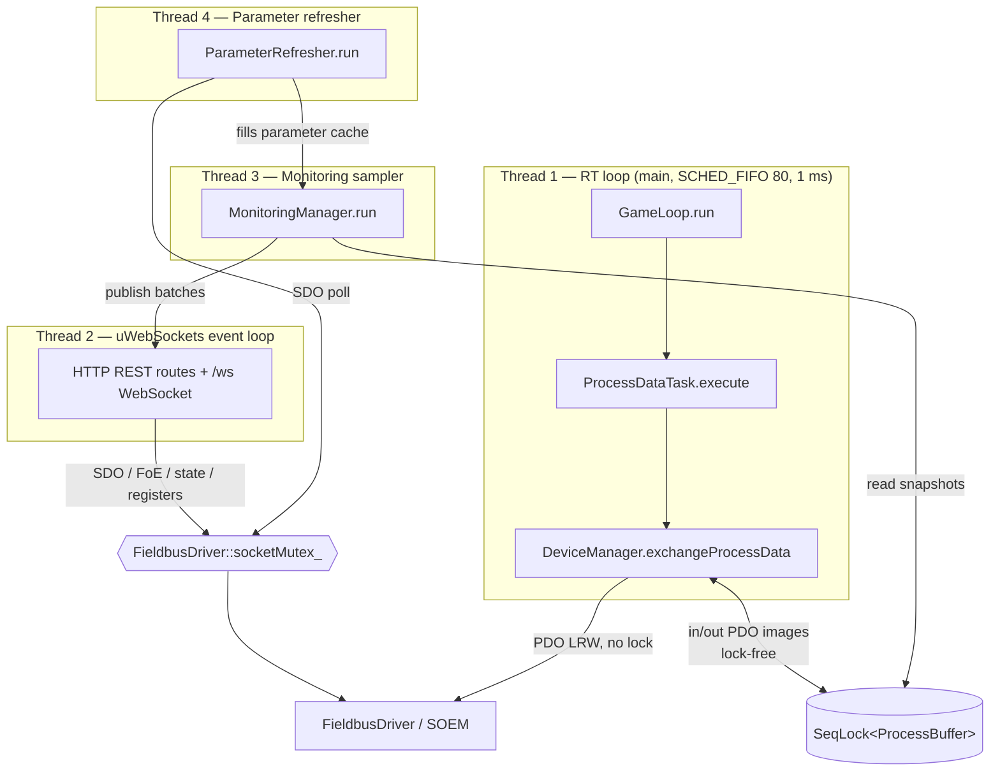

# Threading Model

> **Hand-maintained.** This document is derived by reading the source, not auto-generated.
> GitHub renders the Mermaid diagram below natively. When the threading or
> synchronization design changes, update this file (file/line citations included to
> make that easy).

Motion Master runs **four threads**. The main thread *is* the real-time (RT) thread;
every other subsystem starts its own thread *before* `game_loop.run()` blocks the main
thread.

## Overview

## The four threads

| # | Thread | Created at | Purpose | Scheduling | Synchronization |
|---|--------|-----------|---------|-----------|-----------------|
| 1 | **RT game loop** | main thread becomes it — `apps/motion_master/main.cc:227` (`game_loop.run()`) | Runs `ProcessDataTask::execute()` → `DeviceManager::exchangeProcessData()` once per cycle; the EtherCAT PDO send/receive | `SCHED_FIFO` prio 80 + `mlockall`, `clock_nanosleep(CLOCK_MONOTONIC, TIMER_ABSTIME)` at **1 ms** (`apps/motion_master/game_loop.cc:21,28`) | **Lock-free.** Seqlock for in/out PDO images; `std::atomic` `running_` / `tick_` |
| 2 | **HTTP / WebSocket server** | `std::thread` — `apps/motion_master/server.cc:118` | Single uWebSockets HTTPS + `/ws` event loop; all REST routes and monitoring pub/sub. **One loop, not a thread pool** | Normal | `uWS::Loop::defer()` (atomic job queue) for cross-thread publish; `std::atomic` `loop_` / `app_` pointers |
| 3 | **Monitoring sampler** | `std::thread` — `libs/node/monitoring_manager.cc:154` | Samples monitored parameters at user-configured intervals (≥1 ms), batches rows, publishes to the WebSocket | Normal; `cv_.wait_until(nearest deadline)` | `mutex_` + `cv_`; reads PDO values via the lock-free seqlock snapshots (never touches the bus) |
| 4 | **Parameter refresher** | `std::thread` — `libs/node/parameter_refresher.cc:86` | Background SDO polling for objects **not** in the PDO image, into a cache the sampler reads — decouples slow mailbox access from high-frequency sampling | Normal; ≥10 ms floor + exponential backoff | `mutex_` + `cv_`; takes `FieldbusDriver::socketMutex_` per SDO (releases its own lock during the poll) |

## Control-plane vs PDO-path locking

The single most important rule: **the RT loop never takes a lock.** It touches only the
process-image IOmap and the seqlocks.

- **PDO path (RT loop, thread 1):** `exchangeProcessData()` runs lock-free. SOEM's port
  layer is internally thread-safe, and PDO touches disjoint state (the IOmap) from the
  control plane.
- **Control plane (threads 2 & 4):** every SDO read/write, FoE transfer, ESC register
  access, and AL-state transition serializes through `FieldbusDriver::socketMutex_`, held
  for a single socket transaction only — never across a sleep, a blocking wait, or a user
  callback. A slow SDO read therefore never stalls the 1 ms cycle.

The boundary between control-plane mutation (`init` / `reset` / `configureProcessData`,
on the HTTP thread) and `exchangeProcessData` (on the RT loop) is guarded by an
atomically-published process-image pointer: the RT loop reads it lock-free, and
control-plane operations publish `nullptr` first so exchange becomes a no-op before the
IOmap is rebuilt.

## Lifecycle

Startup and shutdown order (`apps/motion_master/main.cc`):

1. Construct subsystems.
2. `server.start()` — spawns thread 2, listens on `127.0.0.1:8443` (`main.cc:193`).
3. `monitoringManager.start()` — spawns threads 3 and 4 (`main.cc:200`).
4. `game_loop.run()` — main thread becomes the RT thread, blocks until stop (`main.cc:227`).
5. On signal: `game_loop.stop()` returns →
6. `monitoringManager.stop()` — joins threads 3 and 4 (`main.cc:230`).
7. `server.stop()` — closes the listen socket, joins thread 2 (`main.cc:231`).

## Synchronization primitives

| Primitive | Defined in | Protects | Writers → Readers |
|---|---|---|---|
| **SeqLock** | `libs/core/seqlock.h` | Input PDO snapshot + output staging buffer | RT loop (single writer) → sampler + HTTP readers (wait-free) |
| **`FieldbusDriver::socketMutex_`** | `libs/comm/fieldbus_driver.h` | Control-plane socket access (SDO, FoE, registers, state) | HTTP thread + refresher thread — one transaction at a time |
| **`MonitoringManager::mutex_` + `cv_`** | `libs/node/monitoring_manager.h` | Monitoring registry + sampling schedule | Sampler thread, woken on add/remove/stop |
| **`ParameterRefresher::mutex_` + `cv_`** | `libs/node/parameter_refresher.h` | Tracked-object set + poll schedule | Refresher thread (lock released during the actual poll) |
| **`std::atomic` loop pointers** | `apps/motion_master/server.h` | Cross-thread access to the uWS loop for `defer()` | Any thread → server thread |

See also the [class diagram](CLASS_DIAGRAM.md) for ownership relationships.
