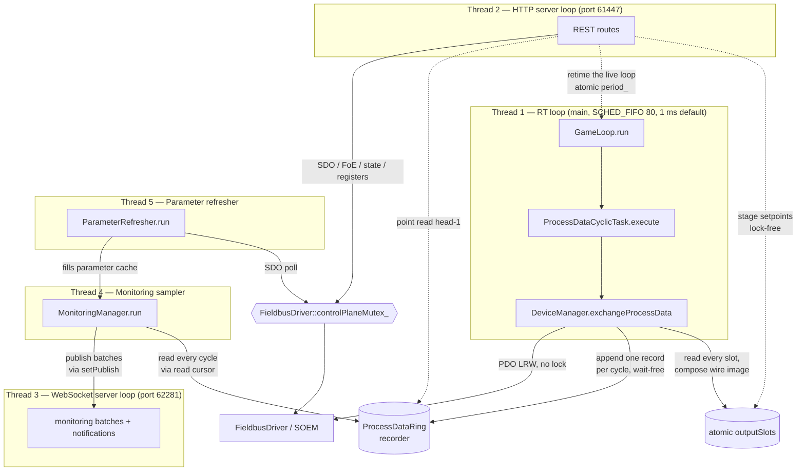

# Threading Model

> **Hand-maintained.** This document is derived by reading the source, not auto-generated.
> GitHub renders the Mermaid diagram below natively. When the threading or
> synchronization design changes, update this file (file/line citations included to
> make that easy).

Motion Master's core runs **five threads**. The main thread *is* the real-time (RT) thread;
every other subsystem starts its own thread *before* `game_loop.run()` blocks the main
thread. The HTTP API and the WebSocket run on **separate ports and separate
event loops/threads** (61447 / 62281), so a slow or blocking HTTP handler can never stall
the WebSocket.

Five is the **built-in** count, not a hard ceiling: a C++ route plug-in (`mm::api`, see
[CLASS_DIAGRAM.md](CLASS_DIAGRAM.md)) is ordinary code holding `DeviceManager&`, and may spawn
its own off-RT `std::jthread` for long-running work — exactly as `MonitoringManager` (threads 4–5)
does. Any such thread is bound by the same rules as every non-RT thread below: serialize bus
access through `FieldbusDriver::controlPlaneMutex_` and never touch the RT path.

## Overview

## The five threads

| # | Thread | Created at | Purpose | Scheduling | Synchronization |
| --- | -------- | ----------- | --------- | ----------- | ----------------- |
| 1 | **RT game loop** | main thread becomes it — `apps/motion_master/main.cc:281` (`gameLoop.run()`) | Runs `ProcessDataCyclicTask::execute()` → `DeviceManager::exchangeProcessData()` once per cycle; the EtherCAT PDO send/receive | `SCHED_FIFO` prio 80 + `mlockall`, `clock_nanosleep(CLOCK_MONOTONIC, TIMER_ABSTIME)` at **1 ms by default** — the period is retimed live by reloading the relaxed atomic `period_` at the top of each iteration (`game_loop.cc:29–30,39`, `cyclic_timer_linux.cc:45`, `game_loop.h:145`) | **Lock-free.** Wait-free append of one record/cycle to the `ProcessDataRing` recorder; `std::atomic` `running_`, and the RT-written diagnostic counters `executedCycles_` / `skippedCycles_` (relaxed — for logging, not synchronization) |
| 2 | **HTTP server** | `std::thread` — `apps/motion_master/http_server.cc:302` | uWebSockets HTTPS event loop on **port 61447**; all REST routes. **One loop, not a thread pool** | Normal | `uWS::Loop::defer()` (atomic job queue) for cross-thread work; `std::atomic` `loop_` / `app_` pointers |
| 3 | **WebSocket server** | `std::thread` — `apps/motion_master/ws_server.cc:26` | Separate uWebSockets WSS event loop on **port 62281**; the WebSocket connection — monitoring batches, notifications, procedure progress out; subscribe in. Isolated from HTTP so a blocking handler can't stall the 1 ms-critical stream | Normal | `uWS::Loop::defer()` for cross-thread `broadcast()` / `publish()`; `std::atomic` `loop_` / `app_` pointers |
| 4 | **Monitoring sampler** | `std::thread` — `libs/node/monitoring_manager.cc:170` | **Lossless.** Each flush ships *every* recorded cycle since each monitoring's read cursor (`[cursor, head)` of the recorder ring) as one batch, then advances the cursor; hands each batch to the `setPublish` callback (wired to `WebSocketServer::publish`). `interval` is the flush **cadence** (5–2000 ms), not a sample rate | Normal; `cv_.wait_until(nearest deadline)` | `mutex_` + `cv_`; decodes PDO values from the lock-free recorder ring (never touches the bus); SDO-only params from the refresher cache |
| 5 | **Parameter refresher** | `std::thread` — `libs/node/parameter_refresher.cc:87` | Background SDO polling for objects **not** in the PDO image, into a cache the sampler reads — decouples slow mailbox access from high-frequency sampling | Normal; ≥10 ms floor + exponential backoff | `mutex_` + `cv_`; takes `FieldbusDriver::controlPlaneMutex_` per SDO (releases its own lock during the poll) |

## Control-plane vs PDO-path locking

The single most important rule: **the RT loop never takes a lock.** It touches only the
process-image IOmap, the atomic `outputSlots`, and the recorder ring (a wait-free append).

- **PDO path (RT loop, thread 1):** `exchangeProcessData()` runs lock-free. SOEM's port
  layer is internally thread-safe, and PDO touches disjoint state (the IOmap) from the
  control plane. Setpoint writes are lock-free *from any thread* too: a writer stores its
  object's bytes into a per-object atomic staging slot (`outputSlots`), and the RT loop is
  the sole thread that composes all slots into the packed wire image each cycle — which is
  what makes bit-packed objects sharing a byte safe without a lock (Design B).
- **Recorder ring (RT writes, threads 2 & 4 read):** the RT loop appends one record per
  cycle (raw input + output IOmap, timestamp, working counter) to `ProcessDataRing` with a
  wait-free `write()` (a few `memcpy` + a release-stored per-slot sequence word). It is the
  single RT-written cross-boundary structure and the source for *both* the lossless live
  monitoring stream (each monitoring reads `[cursor, head)`) and point reads of the freshest
  value (`head()-1`). Readers re-check the per-slot sequence after copying to detect a write
  that raced the copy; a live cursor lapped by more than a whole ring is detected and
  resynced to `oldestValidSeq()`. No lock either side.
- **Control plane (threads 2 & 4):** every SDO read/write, FoE transfer, ESC register
  access, and AL-state transition serializes through `FieldbusDriver::controlPlaneMutex_`, held
  for a single socket transaction only — never across a sleep, a blocking wait, or a user
  callback. A slow SDO read therefore never stalls the 1 ms cycle.
- **Command-and-wait procedures (thread 2), the one long hold:** the per-transaction rule above is
  about `controlPlaneMutex_` and does **not** generalize to `busMutex_`. A multi-second procedure —
  `runStoreParameters` (`device_manager.cc:1249`), `runRestoreDefaultParameters` (`:1263`), the
  `runCia402Command` `enable()` walk — holds `busMutex_` in **shared** mode for its whole duration,
  *including the sleeps between polls* (`profile_device.cc:42,58`), because that is what keeps the
  borrowed `Device&` valid against the exclusive rebuilders. It still takes `controlPlaneMutex_` only
  per SDO transaction, so the RT loop is untouched — but two things follow: an exclusive mutator
  (`scan` / `reset` / `configureProcessData`) blocks behind it for seconds, and because these
  procedures run synchronously on the single HTTP event loop, that loop is occupied for the whole
  run. Isolating the WebSocket on its own thread (thread 3) is what keeps the 1 ms-critical
  monitoring stream flowing across such a hold.

The boundary between control-plane mutation (`init` / `reset` / `configureProcessData`,
on the HTTP thread) and `exchangeProcessData` (on the RT loop) is guarded by an
atomically-published process-image pointer: the RT loop reads it lock-free, and
control-plane operations publish `nullptr` first so exchange becomes a no-op before the
IOmap is rebuilt.

## Lifecycle

Startup and shutdown order (`apps/motion_master/main.cc`):

1. Construct subsystems.
2. `httpServer.start()` — spawns thread 2, listens on `127.0.0.1:61447` (`main.cc:230`).
3. `wsServer.start()` — spawns thread 3, listens on `127.0.0.1:62281` (`main.cc:241`).
4. `monitoringManager.setPublish(...)` wires sampler batches to `wsServer.publish`, then
   `monitoringManager.start()` — spawns threads 4 and 5 (`main.cc:249`, `main.cc:252`).
5. `gameLoop.run()` — main thread becomes the RT thread, blocks until stop (`main.cc:281`).
6. On signal: `gameLoop.stop()` returns →
7. `monitoringManager.stop()` — joins threads 4 and 5 *before* the server loops go away (`main.cc:284`).
8. `wsServer.stop()` then `httpServer.stop()` — close the listen sockets, join threads 3 and 2 (`main.cc:285`, `main.cc:286`).

## Synchronization primitives

| Primitive | Defined in | Protects | Writers → Readers |
| --- | --- | --- | --- |
| **`ProcessDataRing`** (recorder) | `libs/node/process_data_ring.h` | Lossless per-cycle history of the raw IOmap (inputs + outputs + timestamp + WKC); source for the live stream and point reads | RT loop (single writer, wait-free append) → sampler + HTTP readers (lock-free via per-slot sequence re-check) |
| **`ProcessData::outputSlots`** (atomic `uint64_t[]`) | `libs/node/process_data.h` | Per-output-object setpoint staging — one lock-free slot per output object | Any thread stages its own object lock-free (last-writer-wins); RT loop composes all slots into the wire image (Design B) |
| **`FieldbusDriver::controlPlaneMutex_`** | `libs/comm/fieldbus_driver.h` | Control-plane socket access (SDO, FoE, registers, state) | HTTP thread + refresher thread — one transaction at a time |
| **`DeviceManager::busMutex_`** (`shared_mutex`) | `libs/node/device_manager.h` | The non-RT mutable state — `driver_`, `devices_`, and the retained image `generations`; exclusive for the mutators (`init`/`reset`/`scan`/`configureProcessData`/`transitionToState`), shared for position-based value reads **and for the whole duration of a multi-second command-and-wait procedure** (see below). The RT `exchangeProcessData()` never takes it (gated by the atomic image pointer instead) | HTTP/scan threads; lock ordering: `busMutex_` before any `Device::parametersMutex_` |
| **`GameLoop::period_`** (`atomic<microseconds>`) | `apps/motion_master/game_loop.h` | The live cycle period — the one cross-thread *write into* the RT loop. `setPeriod()` stores it (relaxed) and the RT loop reloads it each iteration, so no lock is needed: many writers, a single reader | Any thread → RT loop; reached from `PUT /api/game-loop` via the `setGameLoopPeriod` composition-root callback |
| **`Device::parametersMutex_`** | `libs/node/device.h` | The per-device `parameters_` map (data-type lookup + decode + store) against the off-RT monitoring threads racing the control plane | HTTP thread + refresher/sampler threads |
| **`MonitoringManager::mutex_` + `cv_`** | `libs/node/monitoring_manager.h` | Monitoring registry + sampling schedule | Sampler thread, woken on add/remove/stop |
| **`ParameterRefresher::mutex_` + `cv_`** | `libs/node/parameter_refresher.h` | Tracked-object set + poll schedule | Refresher thread (lock released during the actual poll) |
| **`std::atomic` loop pointers** | `apps/motion_master/http_server.h`, `apps/motion_master/ws_server.h` | Cross-thread access to each uWS loop for `defer()` (HTTP and WS loops are independent) | Any thread → the respective server thread |

See also the [class diagram](CLASS_DIAGRAM.md) for ownership relationships, and
[RT_SCHEDULING.md](RT_SCHEDULING.md) for a primer on the `SCHED_FIFO` / `mlockall`
primitives thread 1 relies on.
