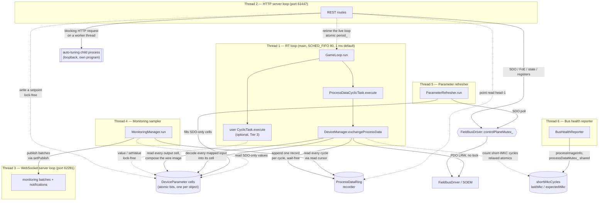

# Threading Model

> **Hand-maintained.** This file is derived by reading the source, not generated. GitHub renders
> the Mermaid diagram below. When the threading design or the synchronisation design changes,
> update this file in the same commit.

Motion Master runs **six long-lived threads**. The main thread *is* the real-time thread. Every
other subsystem starts its own thread *before* `gameLoop.run()` blocks the main thread.

The HTTP API and the WebSocket run on **separate ports, separate event loops and separate
threads**: 61447 and 62281. So a slow HTTP handler can never stall the WebSocket.

Six is the **named** count, not the number of threads in the process. Two pools sit beside those
six, and both matter when you reason about concurrency:

- **32 HTTP worker threads** (`BS::light_thread_pool pool_{32}` in
  `apps/motion_master/http_server.h`). **Every route handler runs on one of these**, not on the
  HTTP event loop. See `mm::api::Router`. So "the HTTP thread" is a dispatcher, and two REST
  requests genuinely run at the same time.
- **One `std::jthread` for each procedure in flight**, owned by `ProcedureManager`.

One **child process** also belongs in this picture. The auto-tuning executable
(`libs/auto_tuning/process.h`) is a separate program that serves an HTTP API on loopback. It runs
outside this process, so none of its threads appear here. Two facts about it matter to the
threading model:

- **`main()` starts it before the main thread becomes real-time.** A child inherits the
  scheduling policy of the thread that spawned it, and this child spin-waits across one worker
  thread per core. See [RT_SCHEDULING.md](RT_SCHEDULING.md#a-child-process-inherits-the-policy).
- **The route handler that calls it blocks on an HTTP request.** That call runs on an HTTP worker
  thread, and it holds no lock, so it stalls neither the real-time loop nor another request.

A C++ route plug-in (`mm::api`, see [CLASS_DIAGRAM.md](CLASS_DIAGRAM.md)) is ordinary code that
holds a `DeviceManager&`. It may start its own off-real-time `std::jthread` for long work, exactly
as `MonitoringManager` does. Such a thread obeys the same two rules as every non-real-time thread.
Serialise all bus access through `FieldbusDriver::controlPlaneMutex_`. Never touch the real-time
path.

**A user `CyclicTask` adds no thread. It runs *inside* thread 1.** That is the whole point of the
Tier-3 extension surface (`libs/example/example_cyclic_task.cc`). The real-time loop calls a
task's `execute()` between the timer wake and the next deadline. So everything the task calls must
not block and must not allocate. `Device::value<T>()` and `Device::setValue<T>()` are that
surface. `GameLoop` enters the cycle before it calls any task, which is what makes it safe to
reach a `Device` from there. A task writes no guard and checks nothing. See
[LOCKING.md](LOCKING.md#the-cycle-gate).

For the full synchronisation inventory — every mutex, what each one guards, the lock order and the
lock-free protocols — see **[LOCKING.md](LOCKING.md)**.

## Overview



## The six threads

| # | Thread | Created in | Purpose | Scheduling |
| --- | --- | --- | --- | --- |
| 1 | **RT game loop** | the main thread becomes it (`main.cc`, `gameLoop.run()`) | Runs each registered `CyclicTask::execute()` once per cycle | `SCHED_FIFO` priority 80, plus `mlockall`, plus an optional pin to one core. `clock_nanosleep(CLOCK_MONOTONIC, TIMER_ABSTIME)` at **1 ms by default** |
| 2 | **HTTP server** | `std::thread`, `http_server.cc` | uWebSockets HTTPS event loop on **port 61447**. **Dispatch only** — every route handler runs on the 32-thread worker pool | Normal |
| 3 | **WebSocket server** | `std::thread`, `ws_server.cc` | A separate uWebSockets WSS event loop on **port 62281**. Monitoring batches and notifications go out, subscriptions come in | Normal |
| 4 | **Monitoring sampler** | `std::thread`, `monitoring_manager.cc` | Ships every recorded cycle since each monitoring's read cursor to the `setPublish` callback | Normal. `cv_.wait_until(nearest deadline)` |
| 5 | **Parameter refresher** | `std::thread`, `parameter_refresher.cc` | Polls objects that are **not** in the PDO image over SDO, into their parameter cells | Normal. A 10 ms period floor. A failing object backs off exponentially, to a 2000 ms ceiling |
| 6 | **Bus health reporter** | `std::jthread`, `bus_health_reporter.h` | Calls `processImageInfo()` every 10 s and logs the short-working-counter count when it grows | Normal. A `stop_token` wait, so the destructor does not wait the interval out |

**Thread 1 — the cycle.** `ProcessDataCyclicTask` calls `DeviceManager::exchangeProcessData()`,
which does four things in order. It composes the output image from every output object's cell. It
runs the EtherCAT PDO send and receive. It appends the cycle to the recorder ring. Then it decodes
every mapped input back into its cell. A Tier-3 task runs on this thread too.

The period is retimed live. The loop reloads the relaxed atomic `period_` at the top of each
iteration (`game_loop.cc`, `cyclic_timer_linux.cc`). The thread takes **no lock**. It uses a
`CycleGuard`, which is an atomic depth counter that the loop itself takes around the task list,
relaxed atomic loads and stores on the parameter cells, and a wait-free append to the ring.
`running_` and the diagnostic counters `executedCycles_` and `skippedCycles_` are relaxed atomics.
They are for logging, not for synchronisation.

**Threads 2 and 3 — the servers.** Both use `uWS::Loop::defer()`, an atomic job queue, for
cross-thread work. Both hold `std::atomic` `loop_` and `app_` pointers. **Procedure progress is
deliberately not on the WebSocket.** `ProcedureManager` holds no publish callback, so that surface
is HTTP-poll-only. The WebSocket is isolated from HTTP, so a blocking handler cannot stall the
stream.

**Thread 4 — lossless monitoring.** Each flush ships *every* recorded cycle since the
monitoring's read cursor, which is `[cursor, head)` of the recorder ring, as one batch. It then
advances the cursor. `interval` is the flush **cadence**, from 5 ms to 2000 ms. It is not a sample
rate. PDO values are decoded from the lock-free ring, so the sampler never touches the bus.
SDO-only parameters come from the refresher's cells.

**Thread 5 — the refresher.** It decouples slow mailbox access from high-frequency sampling. It is
also the Tier-3 door: `MonitoringManager::keepFresh` is what lets a cyclic task read an SDO-only
object with `value<T>()`. The thread takes `FieldbusDriver::controlPlaneMutex_` for each SDO, and
it releases its own lock for the duration of the poll.

**Thread 6 — bus health.** A cycle whose working counter comes back below the expected value is a
cycle some device did not answer. The real-time loop is the only thread that sees every cycle, and
it cannot log, so it only counts into relaxed atomics. Something off the real-time thread has to
read them, and nothing already running can: every other background thread sleeps until it has
work. So this reporter has a timer of its own. It is silent unless the count grew since the last
check, so a healthy bus never speaks and one fault is reported once.

The read is `DeviceManager::processImageInfo()`, which takes `processDataMutex_` **shared**. The
counters themselves are relaxed atomics and need no lock. The lock is there because the same call
also walks the retained image generations. The report states two ages rather than two absolute
times, so the line carries its own reference point:

```text
Process data: 3 cycle(s) answered with a short working counter since the bus came up;
the first was 41.2 s and the last 0.4 s before this line
```

The reporter lives in the app, not in `DeviceManager`, because a log warning is a **policy**.
`DeviceManager` is meant to be embeddable without one. An embedder who does not want this thread
simply does not construct it. `NEXTGEN.md` records that the planned `NotificationBus` has this
exact shape, and that bus health is its first source.

## Control plane against the PDO path

The single most important rule is this: **the real-time loop never takes a lock.** It touches only
the process-image IOmap, the atomic parameter cells and the recorder ring. The full detail — the
order, the drain protocol, the invariants — is in [LOCKING.md](LOCKING.md). The shape is:

| Path | Thread | Synchronisation |
| --- | --- | --- |
| PDO exchange | 1 | None. SOEM's port layer is thread-safe internally, and PDO touches the IOmap, which is disjoint from the control plane |
| Value read and write | any | None. Every object's value lives in its own `DeviceParameter` cell, a `uint64_t` of raw wire bytes reached through `std::atomic_ref`. Writers store into different objects' cells without contention. The real-time loop is the sole composer of the wire image, which is what makes bit-packed objects that share a byte safe |
| Input decode | 1 | None. Each `ProcessImageEntry` carries the owning `DeviceParameter*`, resolved at publish time. So the decode is a walk over contiguous entries, with **no lookup on the real-time path** |
| Reach a `Device` from a cycle | 1 | `DeviceManager::CycleGuard`, taken by `GameLoop` around the whole task list. One atomic increment and one atomic load. It never blocks. A falsy guard means no image is published, and no task runs that cycle |
| Recorder ring | 1 writes. 2 and 4 read | Wait-free append. A reader re-checks a per-slot sequence number after it copies. A cursor lapped by more than a whole ring is detected and resynced |
| SDO, FoE, registers, AL state | 2 and 5 | `FieldbusDriver::controlPlaneMutex_`, held for a single socket transaction. Never across a sleep, a blocking wait or a user callback |
| Bus health counts | 1 writes. 2 and 6 read | Relaxed atomics in `ProcessData`. The reader reaches them through `processImageInfo()`, which takes `processDataMutex_` **shared**, because it also walks the retained image generations |
| Auto-tuning request | an HTTP worker | None in this process. The call is a blocking HTTP request to the child, and it holds no lock while it waits |

**No long hold, and that is the design.** A procedure that commands and waits for seconds holds a
`DeviceHandle` for its whole duration, *including the sleeps between polls*. `runStoreParameters`,
`runRestoreDefaultParameters` and the `enable()` walk in `runCia402Command` are the examples. A
handle is a `shared_ptr` to the published `DeviceSet`, not a lock, so it keeps the device
constructed while nothing waits for it. A concurrent `scan` publishes a new set, and the procedure
finishes against the retired one. That retired set lives until its last handle releases it. The
procedure still takes `controlPlaneMutex_` for one SDO transaction at a time, so the real-time
loop is untouched. It does **not** hold `busOperationMutex_`, so an AL transition can interleave
with it.

One boundary separates control-plane mutation from real-time work. On one side are `init`,
`reset`, `configureProcessData` and a device's parameter-map swap. The boundary itself is an
atomically published process-image pointer plus an in-cycle depth counter.
`ProcessData::pauseCycle()` publishes `nullptr`, which stops a *new* cycle from starting, because
both `exchangeProcessData` and `CycleGuard` back out on a null image. It then waits out the cycle
already in flight. `resumeCycle()` republishes the image for a mutation that is not a teardown. A
re-map or a rescan publishes a freshly built image instead.

## Lifecycle

Startup and shutdown order (`apps/motion_master/main.cc`):

1. Construct the subsystems. `mm::net::HttpGlobal` comes first, because the HTTP client's
   process-wide state must be initialised once, before any other thread starts.
2. `autoTuning.start()` — spawns the child process and waits for it to serve. **This runs before
   the main thread becomes real-time.** A missing or disabled executable is not an error: only the
   auto-tuning endpoints then fail.
3. `httpServer.start()` — spawns thread 2 and listens on `127.0.0.1:61447`.
4. `wsServer.start()` — spawns thread 3 and listens on `127.0.0.1:62281`.
5. `monitoringManager.setPublish(...)` wires sampler batches to `wsServer.publish`. Then
   `monitoringManager.start()` spawns threads 4 and 5.
6. Construct `BusHealthReporter` — spawns thread 6.
7. Install the `SIGINT` and `SIGTERM` handlers. Each one flips the loop's stop flag, and both
   steps are async-signal-safe.
8. `gameLoop.run()` — the main thread becomes thread 1 and blocks until stop.
9. On a signal: `gameLoop.stop()` makes `run()` return after the current cycle.
10. `monitoringManager.stop()` — joins threads 4 and 5 *before* the server loops go away.
11. `wsServer.stop()`, then `httpServer.stop()` — close the listen sockets and join threads 3
    and 2.
12. `autoTuning.stop()` — stops the child. It is stopped here rather than by its destructor, so
    the outcome is logged while the log is still written.
13. The destructors run. `~BusHealthReporter` requests the stop and joins thread 6.

Every `CyclicTask` is registered with `gameLoop.addTask()` **before** step 8. Membership is fixed
for the lifetime of the loop.

## Synchronisation primitives

One line each. See [LOCKING.md](LOCKING.md) for what each one guards in detail, and for the lock
order.

| Primitive | Defined in | Role |
| --- | --- | --- |
| `ProcessDataRing` | `libs/node/process_data_ring.h` | Lossless per-cycle history of the raw IOmap. One real-time writer, many lock-free readers |
| `DeviceParameter::bits` | `libs/node/device_parameter.h` | *The* home of every scalar object's value. Lock-free through `std::atomic_ref` |
| `ProcessData::image` and `inCycle` | `libs/node/process_data.h` | The cycle gate: how a control-plane mutation waits out the real-time thread without a shared lock |
| `FieldbusDriver::controlPlaneMutex_` | `libs/comm/fieldbus_driver.h` | Control-plane socket access, one transaction at a time |
| `DeviceManager::busOperationMutex_` | `libs/node/device_manager.h` | A token over an *activity*: one control-plane operation drives the bus at a time |
| `DeviceManager::currentSetMutex_` | `libs/node/device_manager.h` | The published `shared_ptr<DeviceSet>` itself, held for one pointer copy. Device lifetime is the refcount's job |
| `DeviceManager::processDataMutex_` | `libs/node/device_manager.h` | The recorder ring's storage and the retained image generations, against `allocate` and `clear` |
| `Device::parametersMutex_` | `libs/node/device.h` | The per-device parameter map's structure, and its entries' non-atomic fields. Not the cell |
| `GameLoop::period_` | `apps/motion_master/game_loop.h` | The live cycle period. The one cross-thread write *into* the real-time loop |
| `MonitoringManager::mutex_` and `cv_` | `libs/node/monitoring_manager.h` | The monitoring registry and the sampling schedule |
| `ParameterRefresher::mutex_` and `cv_` | `libs/node/parameter_refresher.h` | The tracked-object set and the poll schedule |
| `std::atomic` loop pointers | `http_server.h`, `ws_server.h` | Cross-thread access to each uWS loop, for `defer()` |

See also the [class diagram](CLASS_DIAGRAM.md) for ownership, and
[RT_SCHEDULING.md](RT_SCHEDULING.md) for a primer on the primitives thread 1 relies on.
