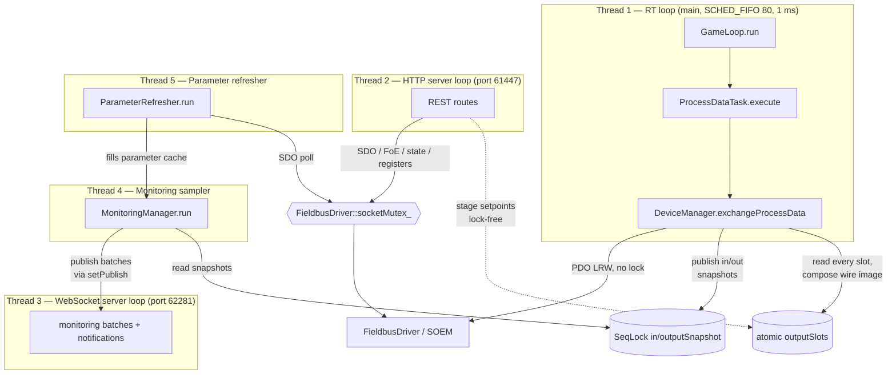

# Threading Model

> **Hand-maintained.** This document is derived by reading the source, not auto-generated.
> GitHub renders the Mermaid diagram below natively. When the threading or
> synchronization design changes, update this file (file/line citations included to
> make that easy).

Motion Master runs **five threads**. The main thread *is* the real-time (RT) thread;
every other subsystem starts its own thread *before* `game_loop.run()` blocks the main
thread. The HTTP API and the realtime WebSocket run on **separate ports and separate
event loops/threads** (61447 / 62281), so a slow or blocking HTTP handler can never stall
the WebSocket.

## Overview

## The five threads

| # | Thread | Created at | Purpose | Scheduling | Synchronization |
|---|--------|-----------|---------|-----------|-----------------|
| 1 | **RT game loop** | main thread becomes it — `apps/motion_master/main.cc:305` (`game_loop.run()`) | Runs `ProcessDataTask::execute()` → `DeviceManager::exchangeProcessData()` once per cycle; the EtherCAT PDO send/receive | `SCHED_FIFO` prio 80 + `mlockall`, `clock_nanosleep(CLOCK_MONOTONIC, TIMER_ABSTIME)` at **1 ms** (`game_loop.cc:20,28`, `cyclic_timer_linux.cc:26`) | **Lock-free.** Seqlock for in/out PDO images; `std::atomic` `running_` / `tick_` |
| 2 | **HTTP server** | `std::thread` — `apps/motion_master/http_server.cc:152` | uWebSockets HTTPS event loop on **port 61447**; all REST routes. **One loop, not a thread pool** | Normal | `uWS::Loop::defer()` (atomic job queue) for cross-thread work; `std::atomic` `loop_` / `app_` pointers |
| 3 | **WebSocket server** | `std::thread` — `apps/motion_master/ws_server.cc:26` | Separate uWebSockets WSS event loop on **port 62281**; realtime channel — monitoring batches, notifications, procedure progress out; subscribe in. Isolated from HTTP so a blocking handler can't stall the 1 ms-critical stream | Normal | `uWS::Loop::defer()` for cross-thread `broadcast()` / `publish()`; `std::atomic` `loop_` / `app_` pointers |
| 4 | **Monitoring sampler** | `std::thread` — `libs/node/monitoring_manager.cc:154` | Samples monitored parameters at user-configured intervals (≥1 ms), batches rows, hands each batch to the `setPublish` callback (wired to `WebSocketServer::publish`) | Normal; `cv_.wait_until(nearest deadline)` | `mutex_` + `cv_`; reads PDO values via the lock-free seqlock snapshots (never touches the bus) |
| 5 | **Parameter refresher** | `std::thread` — `libs/node/parameter_refresher.cc:86` | Background SDO polling for objects **not** in the PDO image, into a cache the sampler reads — decouples slow mailbox access from high-frequency sampling | Normal; ≥10 ms floor + exponential backoff | `mutex_` + `cv_`; takes `FieldbusDriver::socketMutex_` per SDO (releases its own lock during the poll) |

## Control-plane vs PDO-path locking

The single most important rule: **the RT loop never takes a lock.** It touches only the
process-image IOmap and the seqlocks.

- **PDO path (RT loop, thread 1):** `exchangeProcessData()` runs lock-free. SOEM's port
  layer is internally thread-safe, and PDO touches disjoint state (the IOmap) from the
  control plane. Setpoint writes are lock-free *from any thread* too: a writer stores its
  object's bytes into a per-object atomic staging slot (`outputSlots`), and the RT loop is
  the sole thread that composes all slots into the packed wire image each cycle — which is
  what makes bit-packed objects sharing a byte safe without a lock (Design B).
- **Control plane (threads 2 & 4):** every SDO read/write, FoE transfer, ESC register
  access, and AL-state transition serializes through `FieldbusDriver::socketMutex_`, held
  for a single socket transaction only — never across a sleep, a blocking wait, or a user
  callback. A slow SDO read therefore never stalls the 1 ms cycle.

The boundary between control-plane mutation (`init` / `reset` / `configureProcessData`,
on the HTTP thread) and `exchangeProcessData` (on the RT loop) is guarded by an
atomically-published process-image pointer: the RT loop reads it lock-free, and
control-plane operations publish `nullptr` first so exchange becomes a no-op before the
IOmap is rebuilt.

## Lifecycle

Startup and shutdown order (`apps/motion_master/main.cc`):

1. Construct subsystems.
2. `httpServer.start()` — spawns thread 2, listens on `127.0.0.1:61447` (`main.cc:264`).
3. `wsServer.start()` — spawns thread 3, listens on `127.0.0.1:62281` (`main.cc:271`).
4. `monitoringManager.setPublish(...)` wires sampler batches to `wsServer.publish`, then
   `monitoringManager.start()` — spawns threads 4 and 5 (`main.cc:275`, `main.cc:278`).
5. `game_loop.run()` — main thread becomes the RT thread, blocks until stop (`main.cc:305`).
6. On signal: `game_loop.stop()` returns →
7. `monitoringManager.stop()` — joins threads 4 and 5 *before* the server loops go away (`main.cc:308`).
8. `wsServer.stop()` then `httpServer.stop()` — close the listen sockets, join threads 3 and 2 (`main.cc:309`, `main.cc:310`).

## Synchronization primitives

| Primitive | Defined in | Protects | Writers → Readers |
|---|---|---|---|
| **SeqLock** (×2) | `libs/core/seqlock.h` | `inputSnapshot` (last received image) + `outputSnapshot` (read-back of the composed wire image) | RT loop (single writer) → sampler + HTTP readers (wait-free) |
| **`ProcessData::outputSlots`** (atomic `uint64_t[]`) | `libs/node/process_data.h` | Per-output-object setpoint staging — one lock-free slot per output object | Any thread stages its own object lock-free (last-writer-wins); RT loop composes all slots into the wire image (Design B) |
| **`FieldbusDriver::socketMutex_`** | `libs/comm/fieldbus_driver.h` | Control-plane socket access (SDO, FoE, registers, state) | HTTP thread + refresher thread — one transaction at a time |
| **`MonitoringManager::mutex_` + `cv_`** | `libs/node/monitoring_manager.h` | Monitoring registry + sampling schedule | Sampler thread, woken on add/remove/stop |
| **`ParameterRefresher::mutex_` + `cv_`** | `libs/node/parameter_refresher.h` | Tracked-object set + poll schedule | Refresher thread (lock released during the actual poll) |
| **`std::atomic` loop pointers** | `apps/motion_master/http_server.h`, `apps/motion_master/ws_server.h` | Cross-thread access to each uWS loop for `defer()` (HTTP and WS loops are independent) | Any thread → the respective server thread |

See also the [class diagram](CLASS_DIAGRAM.md) for ownership relationships.
