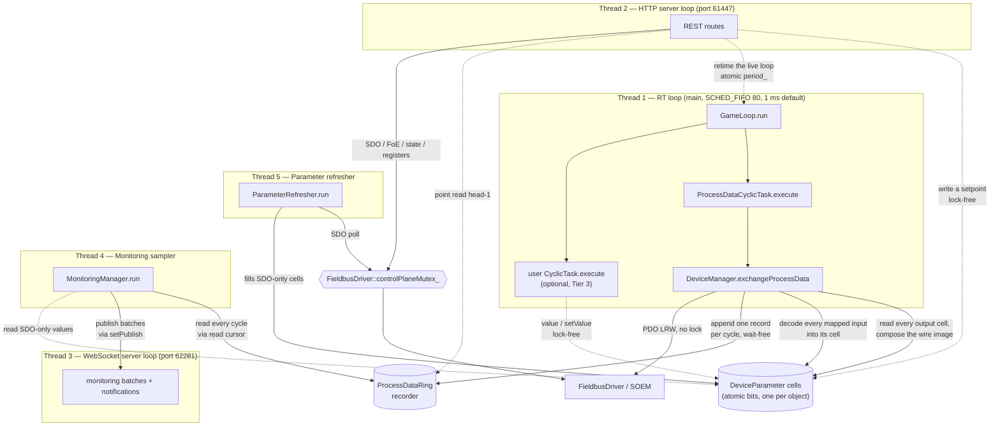

# Threading Model

> **Hand-maintained.** This document is derived by reading the source, not auto-generated.
> GitHub renders the Mermaid diagram below natively. When the threading or
> synchronization design changes, update this file (file/line citations included to
> make that easy).

Motion Master's core runs **five long-lived threads**. The main thread *is* the real-time (RT)
thread; every other subsystem starts its own thread *before* `game_loop.run()` blocks the main
thread. The HTTP API and the WebSocket run on **separate ports and separate
event loops/threads** (61447 / 62281), so a slow or blocking HTTP handler can never stall
the WebSocket.

Five is the **named** count, not the total number of threads in the process. Two pools sit
alongside them, and both matter when reasoning about concurrency:

- **32 HTTP worker threads** (`BS::light_thread_pool pool_{32}`, `apps/motion_master/http_server.h`).
  **Every route handler runs on one of these**, not on the HTTP event loop — see `mm::api::Router`.
  So "the HTTP thread" is a dispatcher, and two REST requests genuinely run in parallel.
- **One `std::jthread` per in-flight procedure**, owned by `ProcedureManager`.

A C++ route plug-in (`mm::api`, see [CLASS_DIAGRAM.md](CLASS_DIAGRAM.md)) is ordinary code holding
`DeviceManager&`, and may spawn its own off-RT `std::jthread` for long-running work — exactly as
`MonitoringManager` (threads 4–5) does. Any such thread is bound by the same rules as every non-RT
thread below: serialize bus access through `FieldbusDriver::controlPlaneMutex_` and never touch the
RT path.

**A user `CyclicTask` adds no thread — it runs *inside* thread 1.** That is the whole point of the
Tier-3 extension surface (`libs/example/example_cyclic_task.cc`): a task's `execute()` is called from
the RT loop between the timer wake and the next deadline, so everything it calls must be non-blocking
and non-allocating. `Device::value<T>()` / `setValue<T>()` are that surface, and
`DeviceManager::CycleLock` is what makes reaching a `Device` from there safe — see
[LOCKING.md](LOCKING.md#the-cycle-gate).

For the full synchronization inventory — every mutex, what it guards, the lock ordering, and the
lock-free protocols — see **[LOCKING.md](LOCKING.md)**.

## Overview

## The five threads

| # | Thread | Created at | Purpose | Scheduling | Synchronization |
| --- | -------- | ----------- | --------- | ----------- | ----------------- |
| 1 | **RT game loop** | main thread becomes it — `apps/motion_master/main.cc:355` (`gameLoop.run()`) | Runs each registered `CyclicTask::execute()` once per cycle. `ProcessDataCyclicTask` → `DeviceManager::exchangeProcessData()`: compose the output image from every output object's cell, the EtherCAT PDO send/receive, append the cycle to the recorder, then decode every mapped input back into its cell. A user (Tier-3) task runs here too | `SCHED_FIFO` prio 80 + `mlockall`, `clock_nanosleep(CLOCK_MONOTONIC, TIMER_ABSTIME)` at **1 ms by default** — the period is retimed live by reloading the relaxed atomic `period_` at the top of each iteration (`game_loop.cc:29–30,39`, `cyclic_timer_linux.cc:45`, `game_loop.h:155`) | **Lock-free.** `DeviceManager::CycleLock` (an atomic depth counter, not a mutex) around any body that resolves devices/parameters; relaxed atomic loads/stores on the parameter cells; wait-free append of one record/cycle to the `ProcessDataRing` recorder; `std::atomic` `running_`, and the RT-written diagnostic counters `executedCycles_` / `skippedCycles_` (relaxed — for logging, not synchronization) |
| 2 | **HTTP server** | `std::thread` — `apps/motion_master/http_server.cc:387` | uWebSockets HTTPS event loop on **port 61447**. **Dispatch only** — every route handler runs on the 32-thread worker pool (see above) | Normal | `uWS::Loop::defer()` (atomic job queue) for cross-thread work; `std::atomic` `loop_` / `app_` pointers |
| 3 | **WebSocket server** | `std::thread` — `apps/motion_master/ws_server.cc:26` | Separate uWebSockets WSS event loop on **port 62281**; the WebSocket connection — monitoring batches and notifications out; subscribe in. **Procedure progress is deliberately not here** — `ProcedureManager` holds no publish callback, so that surface is HTTP-poll-only. Isolated from HTTP so a blocking handler can't stall the 1 ms-critical stream | Normal | `uWS::Loop::defer()` for cross-thread `broadcast()` / `publish()`; `std::atomic` `loop_` / `app_` pointers |
| 4 | **Monitoring sampler** | `std::thread` — `libs/node/monitoring_manager.cc:174` | **Lossless.** Each flush ships *every* recorded cycle since each monitoring's read cursor (`[cursor, head)` of the recorder ring) as one batch, then advances the cursor; hands each batch to the `setPublish` callback (wired to `WebSocketServer::publish`). `interval` is the flush **cadence** (5–2000 ms), not a sample rate | Normal; `cv_.wait_until(nearest deadline)` | `mutex_` + `cv_`; decodes PDO values from the lock-free recorder ring (never touches the bus); SDO-only params from the refresher cache |
| 5 | **Parameter refresher** | `std::thread` — `libs/node/parameter_refresher.cc:91` | Background SDO polling for objects **not** in the PDO image, into their parameter cells — decouples slow mailbox access from high-frequency sampling. Also the Tier-3 door (`MonitoringManager::keepFresh`) that lets a cyclic task read an SDO-only object with `value<T>()` | Normal; ≥10 ms floor + exponential backoff | `mutex_` + `cv_`; takes `FieldbusDriver::controlPlaneMutex_` per SDO (releases its own lock during the poll) |

## Control-plane vs PDO-path locking

The single most important rule: **the RT loop never takes a lock.** It touches only the
process-image IOmap, the atomic parameter cells, and the recorder ring (a wait-free append).

- **PDO path (RT loop, thread 1):** `exchangeProcessData()` runs lock-free. SOEM's port
  layer is internally thread-safe, and PDO touches disjoint state (the IOmap) from the
  control plane. Value access is lock-free *from any thread* too: every object's value lives
  in its own `DeviceParameter` cell (a `uint64_t` of raw little-endian wire bytes reached
  through `std::atomic_ref`), any number of writers store into *different* objects' cells
  without contending, and the RT loop is the sole thread that composes the output cells into
  the packed wire image each cycle — which is what makes bit-packed objects sharing a byte
  safe without a lock (Design B). There are no separate staging slots: a write reads back as
  itself, and a re-map has nothing to seed.
- **Input decode (RT loop, thread 1):** right after the frame arrives, the loop copies every
  mapped object's bytes out of the input image into its cell, read or not. Each
  `ProcessImageEntry` carries the owning `DeviceParameter*`, resolved at publish time, so the
  decode is a walk over contiguous entries with **no lookups on the RT path** — a per-object
  hash lookup would cost 60–100 µs against a 1 ms grid at 50 devices × 40 objects. Paying a
  bounded cost once in the producer is what makes every consumer (a cyclic task, an HTTP read,
  monitoring) a single atomic load.
- **Reaching a `Device` from a cycle (RT loop, thread 1):** a cyclic task resolves its own
  devices and parameters (`DeviceManager::findDevice`, `Device::findParameter` — both public and
  lock-free for exactly this reason) rather than being handed them, so it must not run while
  `scan`/`reset` is destroying the vector it walks. `DeviceManager::CycleLock`, constructed at the
  top of `execute()`, is what holds both still: one atomic increment and one atomic load, never a
  block. Falsy means no image is published — the bus's "not activated" state — and the task does
  nothing that cycle.
- **Recorder ring (RT writes, threads 2 & 4 read):** the RT loop appends one record per
  cycle (raw input + output IOmap, timestamp, working counter) to `ProcessDataRing` with a
  wait-free `write()` (a few `memcpy` + a release-stored per-slot sequence word). It is the
  single RT-written cross-boundary structure and the source for *both* the lossless live
  monitoring stream (each monitoring reads `[cursor, head)`) and point reads of the freshest
  value (`head()-1`). Readers re-check the per-slot sequence after copying to detect a write
  that raced the copy; a live cursor lapped by more than a whole ring is detected and
  resynced to `oldestValidSeq()`. No lock either side.
- **Control plane (threads 2 & 4):** every SDO read/write, FoE transfer, ESC register
  access, and AL-state transition serializes through `FieldbusDriver::controlPlaneMutex_`, held
  for a single socket transaction only — never across a sleep, a blocking wait, or a user
  callback. A slow SDO read therefore never stalls the 1 ms cycle.
- **Command-and-wait procedures, the one long hold:** the per-transaction rule above is about
  `controlPlaneMutex_` and does **not** generalize to `DeviceManager::deviceSetMutex_`. A
  multi-second procedure — `runStoreParameters`, `runRestoreDefaultParameters`, the
  `runCia402Command` `enable()` walk — holds `deviceSetMutex_` in **shared** mode for its whole
  duration, *including the sleeps between polls* (`profile_device.cc:42,58`), because that is what
  keeps the borrowed `Device&` valid against the exclusive rebuilders. It still takes
  `controlPlaneMutex_` only per SDO transaction, so the RT loop is untouched — and because it holds
  only the *shared* lock, other readers and borrowers run alongside it; just `scan` / `reset` and a
  re-map's publish window wait. It does **not** hold `busOperationMutex_`, so an AL transition can
  interleave with it (see [LOCKING.md](LOCKING.md)).

The boundary between control-plane mutation (`init` / `reset` / `configureProcessData`, and now
also a device's parameter-map swap) and RT work is guarded by an atomically-published
process-image pointer plus an in-cycle depth counter: `ProcessData::pauseCycle()` publishes
`nullptr` — which stops a *new* cycle starting, since both `exchangeProcessData` and `CycleLock`
back out on a null image — then waits out the one already in flight. `resumeCycle()` republishes
for a mutation that is not a teardown (a parameter-map swap); a re-map or a rescan simply publishes
a freshly built image instead.

## Lifecycle

Startup and shutdown order (`apps/motion_master/main.cc`):

1. Construct subsystems.
2. `httpServer.start()` — spawns thread 2, listens on `127.0.0.1:61447` (`main.cc:279`).
3. `wsServer.start()` — spawns thread 3, listens on `127.0.0.1:62281` (`main.cc:291`).
4. `monitoringManager.setPublish(...)` wires sampler batches to `wsServer.publish`, then
   `monitoringManager.start()` — spawns threads 4 and 5 (`main.cc:317`, `main.cc:320`).
5. `gameLoop.run()` — main thread becomes the RT thread, blocks until stop (`main.cc:355`).
6. On signal: `gameLoop.stop()` returns →
7. `monitoringManager.stop()` — joins threads 4 and 5 *before* the server loops go away (`main.cc:358`).
8. `wsServer.stop()` then `httpServer.stop()` — close the listen sockets, join threads 3 and 2 (`main.cc:359`, `main.cc:360`).

Every `CyclicTask` is registered with `gameLoop.addTask()` **before** step 5 (`main.cc:241`);
membership is fixed for the loop's lifetime.

## Synchronization primitives

| Primitive | Defined in | Protects | Writers → Readers |
| --- | --- | --- | --- |
| **`ProcessDataRing`** (recorder) | `libs/node/process_data_ring.h` | Lossless per-cycle history of the raw IOmap (inputs + outputs + timestamp + WKC); source for the live stream and point reads | RT loop (single writer, wait-free append) → sampler + HTTP readers (lock-free via per-slot sequence re-check) |
| **`DeviceParameter::bits`** (`uint64_t` via `std::atomic_ref`) | `libs/node/device_parameter.h` | *The* home of every scalar object's value — raw little-endian wire bytes, LSB-aligned. One cell per object, so it is both the setpoint a writer stores and the reading the RT decode publishes | Any thread stores its own object's cell lock-free (last-writer-wins) and any thread loads it (relaxed); the RT loop composes the output cells into the wire image and decodes the inputs back (Design B) |
| **`ProcessData::inCycle`** (`atomic<int>`) | `libs/node/process_data.h` | How deep the RT thread is inside work that reads the device set or the IOmap. A *depth* counter, not a flag, because it is raised at two nesting levels: `CycleLock` around a whole task body and `exchangeProcessData` around the exchange | RT loop raises/lowers (seq_cst against the image store); the control plane's `pauseCycle()` waits it out, bounded at 200 ms and logged if it expires |
| **`FieldbusDriver::controlPlaneMutex_`** | `libs/comm/fieldbus_driver.h` | Control-plane socket access (SDO, FoE, registers, state) | HTTP thread + refresher thread — one transaction at a time |
| **`DeviceManager::busOperationMutex_`** (`mutex`) | `libs/node/device_manager.h` | Nothing — a mutual-exclusion token over an *activity*: one control-plane operation drives the bus at a time. Held for their whole duration by `init`/`scan`/`reset`/`configureProcessData`/`transitionToState`/`writeDevicePdoMapping`. No reader or borrower takes it | HTTP workers only; taken **before** `deviceSetMutex_` |
| **`DeviceManager::deviceSetMutex_`** (`shared_mutex`) | `libs/node/device_manager.h` | *Lifetime*: `devices_`, `driver_`, the retained image `generations` and the recorder-ring storage are not being rebuilt or freed. Exclusive for `init`/`reset`/`scan` and the re-map publish window; shared for every position-based read/write, `withDevice`, the ring accessors **and the whole duration of a multi-second command-and-wait procedure**. Neither the RT `exchangeProcessData()` nor a cyclic task takes it — they are gated by the image pointer + `inCycle` instead | HTTP workers, sampler, refresher, procedure threads; ordering: `busOperationMutex_` → `deviceSetMutex_` → `Device::parametersMutex_` → `FieldbusDriver::controlPlaneMutex_` |
| **`GameLoop::period_`** (`atomic<microseconds>`) | `apps/motion_master/game_loop.h` | The live cycle period — the one cross-thread *write into* the RT loop. `setPeriod()` stores it (relaxed) and the RT loop reloads it each iteration, so no lock is needed: many writers, a single reader | Any thread → RT loop; reached from `PUT /api/game-loop` via the `setGameLoopPeriod` composition-root callback |
| **`Device::parametersMutex_`** | `libs/node/device.h` | The per-device `parameters_` map — its *structure* (a re-enumeration replaces it wholesale) and the non-atomic fields on an entry, against the off-RT monitoring threads racing the control plane. Not the cell: `bits` is read and written without it | HTTP workers + refresher/sampler threads. Never held across bus I/O |
| **`MonitoringManager::mutex_` + `cv_`** | `libs/node/monitoring_manager.h` | Monitoring registry + sampling schedule | Sampler thread, woken on add/remove/stop |
| **`ParameterRefresher::mutex_` + `cv_`** | `libs/node/parameter_refresher.h` | Tracked-object set + poll schedule | Refresher thread (lock released during the actual poll) |
| **`std::atomic` loop pointers** | `apps/motion_master/http_server.h`, `apps/motion_master/ws_server.h` | Cross-thread access to each uWS loop for `defer()` (HTTP and WS loops are independent) | Any thread → the respective server thread |

See also the [class diagram](CLASS_DIAGRAM.md) for ownership relationships, and
[RT_SCHEDULING.md](RT_SCHEDULING.md) for a primer on the `SCHED_FIFO` / `mlockall`
primitives thread 1 relies on.
