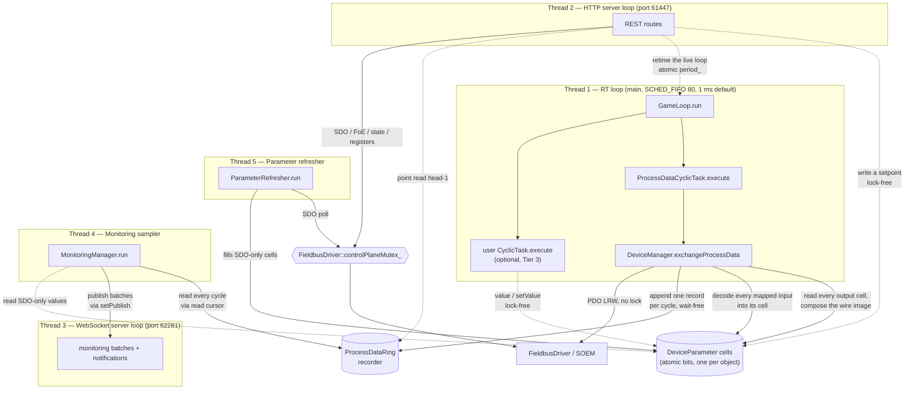

# Threading Model

> **Hand-maintained.** Derived by reading the source, not auto-generated. GitHub renders the
> Mermaid diagram below natively. When the threading or synchronization design changes, update
> this file.

Motion Master's core runs **five long-lived threads**. The main thread *is* the real-time (RT)
thread; every other subsystem starts its own thread *before* `game_loop.run()` blocks the main
thread. The HTTP API and the WebSocket run on **separate ports and separate event loops/threads**
(61447 / 62281), so a slow or blocking HTTP handler can never stall the WebSocket.

Five is the **named** count, not the total number of threads in the process. Two pools sit
alongside them, and both matter when reasoning about concurrency:

- **32 HTTP worker threads** (`BS::light_thread_pool pool_{32}`, `apps/motion_master/http_server.h`).
  **Every route handler runs on one of these**, not on the HTTP event loop — see `mm::api::Router`.
  So "the HTTP thread" is a dispatcher, and two REST requests genuinely run in parallel.
- **One `std::jthread` per in-flight procedure**, owned by `ProcedureManager`.

A C++ route plug-in (`mm::api`, see [CLASS_DIAGRAM.md](CLASS_DIAGRAM.md)) is ordinary code holding
`DeviceManager&`, and may spawn its own off-RT `std::jthread` for long-running work — exactly as
`MonitoringManager` (threads 4–5) does. Any such thread is bound by the same rules as every non-RT
thread: serialize bus access through `FieldbusDriver::controlPlaneMutex_` and never touch the RT
path.

**A user `CyclicTask` adds no thread — it runs *inside* thread 1.** That is the whole point of the
Tier-3 extension surface (`libs/example/example_cyclic_task.cc`): a task's `execute()` is called from
the RT loop between the timer wake and the next deadline, so everything it calls must be non-blocking
and non-allocating. `Device::value<T>()` / `setValue<T>()` are that surface, and
`DeviceManager::CycleGuard` is what makes reaching a `Device` from there safe — see
[LOCKING.md](LOCKING.md#the-cycle-gate).

For the full synchronization inventory — every mutex, what it guards, the lock ordering, and the
lock-free protocols — see **[LOCKING.md](LOCKING.md)**.

## Overview

## The five threads

| # | Thread | Created in | Purpose | Scheduling |
| --- | --- | --- | --- | --- |
| 1 | **RT game loop** | the main thread becomes it (`main.cc`, `gameLoop.run()`) | Runs each registered `CyclicTask::execute()` once per cycle | `SCHED_FIFO` prio 80 + `mlockall`; `clock_nanosleep(CLOCK_MONOTONIC, TIMER_ABSTIME)` at **1 ms by default** |
| 2 | **HTTP server** | `std::thread`, `http_server.cc` | uWebSockets HTTPS event loop on **port 61447**. **Dispatch only** — every route handler runs on the 32-thread worker pool | Normal |
| 3 | **WebSocket server** | `std::thread`, `ws_server.cc` | Separate uWebSockets WSS event loop on **port 62281**: monitoring batches and notifications out, subscribe in | Normal |
| 4 | **Monitoring sampler** | `std::thread`, `monitoring_manager.cc` | Ships every recorded cycle since each monitoring's read cursor to the `setPublish` callback | Normal; `cv_.wait_until(nearest deadline)` |
| 5 | **Parameter refresher** | `std::thread`, `parameter_refresher.cc` | Background SDO polling for objects **not** in the PDO image, into their parameter cells | Normal; ≥10 ms floor + exponential backoff |

**Thread 1 — the cycle.** `ProcessDataCyclicTask` calls `DeviceManager::exchangeProcessData()`:
compose the output image from every output object's cell, run the EtherCAT PDO send/receive, append
the cycle to the recorder ring, then decode every mapped input back into its cell. A user (Tier-3)
task runs here too. The period is retimed live by reloading the relaxed atomic `period_` at the top
of each iteration (`game_loop.cc`, `cyclic_timer_linux.cc`). The thread takes **no lock**: a
`CycleGuard` (an atomic depth counter) around any body that resolves devices or parameters, relaxed
atomic loads and stores on the parameter cells, and a wait-free append to the ring. `running_` and
the diagnostic counters `executedCycles_` / `skippedCycles_` are relaxed atomics — for logging, not
synchronization.

**Threads 2 and 3 — the servers.** Both use `uWS::Loop::defer()` (an atomic job queue) for
cross-thread work and hold `std::atomic` `loop_` / `app_` pointers. **Procedure progress is
deliberately not on the WebSocket** — `ProcedureManager` holds no publish callback, so that surface
is HTTP-poll-only. The WebSocket is isolated from HTTP so a blocking handler cannot stall the stream.

**Thread 4 — lossless monitoring.** Each flush ships *every* recorded cycle since the monitoring's
read cursor (`[cursor, head)` of the recorder ring) as one batch, then advances the cursor.
`interval` is the flush **cadence** (5–2000 ms), not a sample rate. PDO values are decoded from the
lock-free ring — the sampler never touches the bus — and SDO-only parameters come from the
refresher's cells.

**Thread 5 — the refresher.** Decouples slow mailbox access from high-frequency sampling. It is also
the Tier-3 door (`MonitoringManager::keepFresh`) that lets a cyclic task read an SDO-only object with
`value<T>()`. It takes `FieldbusDriver::controlPlaneMutex_` per SDO and releases its own lock for the
duration of the poll.

## Control-plane vs PDO-path locking

The single most important rule: **the RT loop never takes a lock.** It touches only the process-image
IOmap, the atomic parameter cells, and the recorder ring. Full detail — the ordering, the drain
protocol, the invariants — is in [LOCKING.md](LOCKING.md); the shape is:

| Path | Thread | Synchronization |
| --- | --- | --- |
| PDO exchange | 1 | None. SOEM's port layer is internally thread-safe and PDO touches disjoint state (the IOmap) from the control plane |
| Value read/write | any | None. Every object's value lives in its own `DeviceParameter` cell — a `uint64_t` of raw wire bytes reached through `std::atomic_ref`. Writers store into different objects' cells without contending; the RT loop is the sole composer of the wire image, which is what makes bit-packed objects sharing a byte safe |
| Input decode | 1 | None. Each `ProcessImageEntry` carries the owning `DeviceParameter*`, resolved at publish time, so the decode is a walk over contiguous entries with **no lookups on the RT path** |
| Reaching a `Device` from a cycle | 1 | `DeviceManager::CycleGuard` — one atomic increment and one atomic load, never a block. Falsy means no image is published, and the task does nothing that cycle |
| Recorder ring | 1 writes, 2 & 4 read | Wait-free append; readers re-check a per-slot sequence after copying. A cursor lapped by more than a whole ring is detected and resynced |
| SDO / FoE / registers / AL state | 2 & 5 | `FieldbusDriver::controlPlaneMutex_`, held for a single socket transaction — never across a sleep, a blocking wait, or a user callback |

**The one long hold worth knowing.** A multi-second command-and-wait procedure —
`runStoreParameters`, `runRestoreDefaultParameters`, the `runCia402Command` `enable()` walk — holds
`DeviceManager::deviceSetMutex_` in **shared** mode for its whole duration, *including the sleeps
between polls*, because that is what keeps the borrowed `Device&` valid against the exclusive
rebuilders. It still takes `controlPlaneMutex_` only per SDO transaction, so the RT loop is
untouched, and because the lock is shared, other readers and borrowers run alongside it — only
`scan` / `reset` and a re-map's publish window wait. It does **not** hold `busOperationMutex_`, so an
AL transition can interleave with it.

The boundary between control-plane mutation (`init` / `reset` / `configureProcessData`, and a
device's parameter-map swap) and RT work is guarded by an atomically-published process-image pointer
plus an in-cycle depth counter: `ProcessData::pauseCycle()` publishes `nullptr` — which stops a *new*
cycle starting, since both `exchangeProcessData` and `CycleGuard` back out on a null image — then
waits out the one already in flight. `resumeCycle()` republishes for a mutation that is not a
teardown; a re-map or a rescan publishes a freshly built image instead.

## Lifecycle

Startup and shutdown order (`apps/motion_master/main.cc`):

1. Construct subsystems.
2. `httpServer.start()` — spawns thread 2, listens on `127.0.0.1:61447`.
3. `wsServer.start()` — spawns thread 3, listens on `127.0.0.1:62281`.
4. `monitoringManager.setPublish(...)` wires sampler batches to `wsServer.publish`, then
   `monitoringManager.start()` — spawns threads 4 and 5.
5. `gameLoop.run()` — main thread becomes the RT thread, blocks until stop.
6. On signal: `gameLoop.stop()` returns.
7. `monitoringManager.stop()` — joins threads 4 and 5 *before* the server loops go away.
8. `wsServer.stop()` then `httpServer.stop()` — close the listen sockets, join threads 3 and 2.

Every `CyclicTask` is registered with `gameLoop.addTask()` **before** step 5; membership is fixed for
the loop's lifetime.

## Synchronization primitives

One line each; see [LOCKING.md](LOCKING.md) for what each one guards in detail and for the lock
ordering.

| Primitive | Defined in | Role |
| --- | --- | --- |
| `ProcessDataRing` | `libs/node/process_data_ring.h` | Lossless per-cycle history of the raw IOmap; single RT writer, many lock-free readers |
| `DeviceParameter::bits` | `libs/node/device_parameter.h` | *The* home of every scalar object's value; lock-free through `std::atomic_ref` |
| `ProcessData::image` + `inCycle` | `libs/node/process_data.h` | The cycle gate — how a control-plane mutation waits out the RT thread without a shared lock |
| `FieldbusDriver::controlPlaneMutex_` | `libs/comm/fieldbus_driver.h` | Control-plane socket access, one transaction at a time |
| `DeviceManager::busOperationMutex_` | `libs/node/device_manager.h` | A token over an *activity*: one control-plane operation drives the bus at a time |
| `DeviceManager::deviceSetMutex_` | `libs/node/device_manager.h` | *Lifetime*: `devices_`, `driver_`, the retained generations and ring storage are not being rebuilt or freed |
| `Device::parametersMutex_` | `libs/node/device.h` | The per-device parameter map's structure and its entries' non-atomic fields — not the cell |
| `GameLoop::period_` | `apps/motion_master/game_loop.h` | The live cycle period; the one cross-thread write *into* the RT loop |
| `MonitoringManager::mutex_` + `cv_` | `libs/node/monitoring_manager.h` | Monitoring registry + sampling schedule |
| `ParameterRefresher::mutex_` + `cv_` | `libs/node/parameter_refresher.h` | Tracked-object set + poll schedule |
| `std::atomic` loop pointers | `http_server.h`, `ws_server.h` | Cross-thread access to each uWS loop for `defer()` |

See also the [class diagram](CLASS_DIAGRAM.md) for ownership relationships, and
[RT_SCHEDULING.md](RT_SCHEDULING.md) for a primer on the `SCHED_FIFO` / `mlockall` primitives thread
1 relies on.
